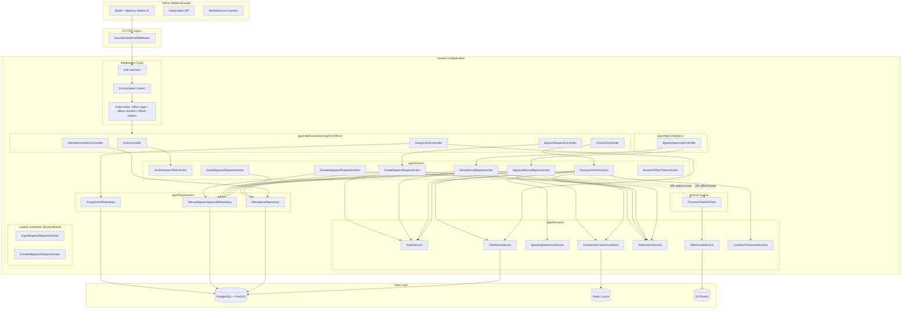
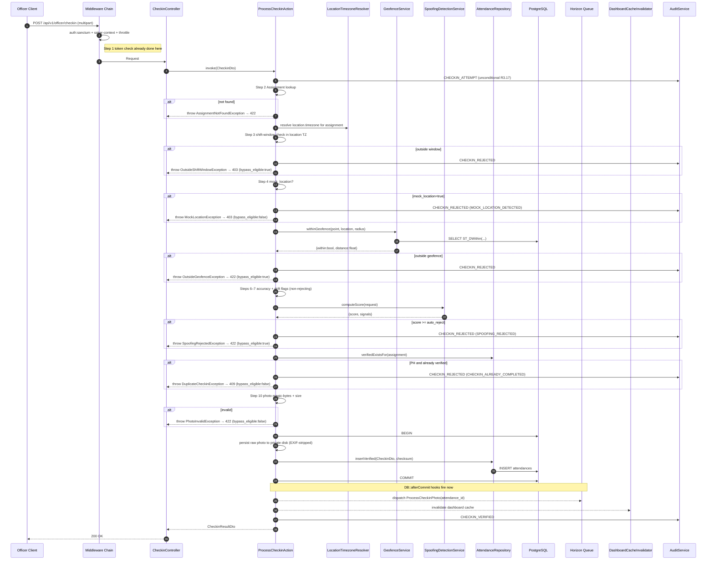
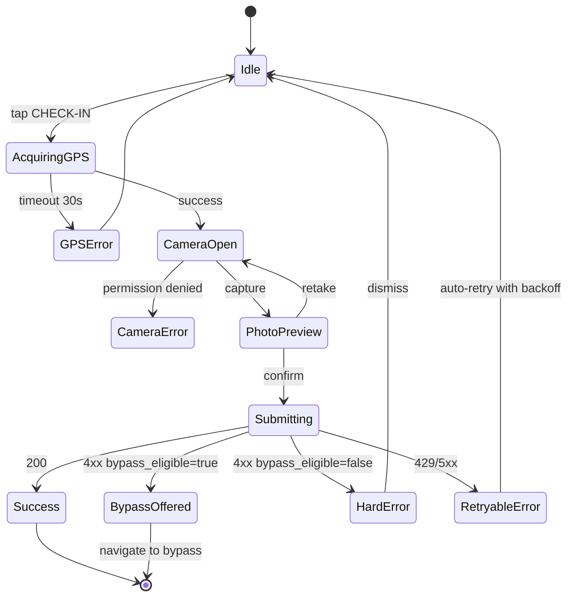

# Design Document — Phase 3: Mobile Officer Check-In

## Introduction

This document specifies the technical design for Phase 3, implementing the Mobile Officer Check-In System defined in `requirements.md`. It is grounded in the **actual** Phase 1–2 codebase (not the PRD idealization). The Phase 1–2 work that shipped:

- All PostgreSQL + PostGIS migrations, including `no_update_*` rules on `attendances`, `manual_bypass_approvals`, and `audit_logs`.
- Full admin web UI (session auth): `DashboardController`, `OperationController`, `ZoneController`, `LocationController`, `OfficerController`, `AssignmentController`, `AuditLogController`, `ReportController`. All CRUD + views complete.
- Domain services: `AuditService`, `GeofenceService`, `NotificationService`, `SpoofingDetectionService`, `WatermarkService`.
- Middleware: `EnsureSakerContext` (session-based; Phase 3 extends for Sanctum), `SetGodAdminContext` (alias `god.admin`).
- Models with `HasUuidV7`, `HasAuditTrail`, `SakerScope` traits; Sanctum `HasApiTokens` already on `User`.
- A monolithic `DatabaseSeeder.php` seeding 3 Sakers, 34 users, 4 operations, 8 zones, 15 locations, 30 shifts, assignments, and sample attendances.
- Config `config/policehazard.php` with `timezone`, `geofence`, `bypass` (PH 15m/Patrol 30m), `spoofing`, `photo`, `auth`, `cache`, `escalation` sections.

**Phase 3 design constraints:**
- Purely additive — nothing in `app/Http/Controllers/*` (admin web), `app/Actions/Create*Action.php`, or existing migrations is modified. The three new migrations are narrowly scoped.
- No device binding. No JWT. No client-submitted checksums. No HMAC supervisor signatures. Server-internal attendance checksum stays.
- Photo + server-side watermark stays (evidence-grade).
- Timezone is per-Location (`locations.timezone` IANA string).
- The monolithic seeder is split into 10 entity-focused seeders.

**Schema reality check (observed in Phase 1 migrations):**
- `manual_bypass_approvals` columns: `reviewed_by`, `reviewer_note`, `signature_hmac`, `reviewed_at`, `bypass_reason`, `officer_note`, `expires_at`, `status`, `created_at`. CHECK constraint allows `bypass_reason ∈ ('OUTSIDE_GEOFENCE','OUTSIDE_SHIFT_WINDOW')`. Globally-blocking `no_update_manual_bypass` rule.
- `attendances` has a globally-blocking `no_update_attendances` rule. The `photo_path` / `photo_status` columns exist but cannot currently be updated after insert — a Phase 1 oversight this spec fixes.
- `operations` has `start_time` / `end_time` (time-of-day strings), not `start_date` / `end_date`. Phase 3 accepts this as-is.

---

## 1. Component Architecture



**Design principle.** Controllers are thin orchestrators: they call a FormRequest for validation, invoke one Action, and render the response. All business logic lives in Actions. No Action invokes another Action directly.

---

## 2. HTTP Surface

`routes/api.php` does not exist in Phase 1–2. Phase 3 registers it in `bootstrap/app.php`.

### 2.1 Officer API (new, under `/api/v1/*`)

| Method | Path | Middleware | Controller::Method | Requirement |
|---|---|---|---|---|
| `POST` | `/api/v1/auth/login` | `api`, `throttle:officer-login` | `AuthController@login` | R1.1–R1.6, R1.9–R1.13 |
| `POST` | `/api/v1/auth/logout` | `api`, `auth:sanctum`, `saker-context` | `AuthController@logout` | R1.8 |
| `GET`  | `/api/v1/officer/assignments` | `api`, `auth:sanctum`, `saker-context` | `AssignmentController@index` | R2.1–R2.7, R2.11 |
| `GET`  | `/api/v1/officer/assignments/{id}` | ↑ | `AssignmentController@show` | R2.8, R2.9 |
| `GET`  | `/api/v1/officer/assignments/{id}/distance` | ↑ | `AssignmentController@distance` | R2.10 |
| `POST` | `/api/v1/officer/checkin` | `api`, `auth:sanctum`, `saker-context`, `throttle:officer-checkin` | `CheckinController@store` | R3.* |
| `POST` | `/api/v1/officer/bypass-request` | `api`, `auth:sanctum`, `saker-context`, `throttle:officer-bypass` | `BypassRequestController@store` | R4.2–R4.11, R4.17 |
| `GET`  | `/api/v1/officer/bypass-request/{id}` | `api`, `auth:sanctum`, `saker-context` | `BypassRequestController@show` | R4.12 |
| `GET`  | `/api/v1/officer/attendance/history` | ↑ | `AttendanceHistoryController@index` | R6.1–R6.3, R6.5 |
| `GET`  | `/api/v1/officer/attendance/{id}` | ↑ | `AttendanceHistoryController@show` | R6.4, R6.5 |

### 2.2 Supervisor additions to `routes/web.php`

Added inside the existing `['auth', 'god.admin']` group.

| Method | Path | Controller::Method | Requirement |
|---|---|---|---|
| `GET` | `/bypass-approvals` | `BypassApprovalController@index` | R5.1, R5.2 |
| `GET` | `/bypass-approvals/{id}` | `BypassApprovalController@show` | R5.3 |
| `POST` | `/bypass-approvals/{id}/approve` | `BypassApprovalController@approve` | R5.4, R5.5, R5.7–R5.15 |
| `POST` | `/bypass-approvals/{id}/deny` | `BypassApprovalController@deny` | R5.6–R5.15 |

### 2.3 Mobile Web UI routes (new, public — token-in-sessionStorage)

| Method | Path | View | Requirement |
|---|---|---|---|
| `GET` | `/officer` | redirects to `/officer/login` or `/officer/assignments` based on token presence | R7 |
| `GET` | `/officer/login` | `officer.login` | R7.1 |
| `GET` | `/officer/assignments` | `officer.assignments.index` | R7.3 |
| `GET` | `/officer/assignments/{id}` | `officer.assignments.show` | R7.4, R7.5 |
| `GET` | `/officer/checkin/{assignmentId}` | `officer.checkin` | R7.6–R7.9 |
| `GET` | `/officer/bypass/{bypassId?}` | `officer.bypass` | R7.10–R7.14 |
| `GET` | `/officer/history` | `officer.history.index` | R7.15 |

### 2.4 Error Envelope — RFC 7807 + reason_code

All `/api/v1/*` error responses use `Content-Type: application/problem+json` (R1.13 via `X-Request-ID`):

```json
{
  "type": "https://policehazard.local/errors/OUTSIDE_GEOFENCE",
  "title": "Di luar geofence",
  "status": 422,
  "detail": "Lokasi Anda 87.3 meter dari Pos Jaga Merdeka (radius 50m).",
  "instance": "/api/v1/officer/checkin",
  "reason_code": "OUTSIDE_GEOFENCE",
  "request_id": "01HZ...",
  "distance_meters": 87.3,
  "bypass_eligible": true
}
```

`bypass_eligible` is always present on 4xx responses (R4.1 / P8). Success responses are plain JSON (`application/json`).

### 2.5 Authentication — Sanctum PAT (no device binding)

`AuthController@login` calls `AuthenticateOfficerAction`:

```php
$user = User::withoutGlobalScopes()->where('nrp', $nrp)->first();
// credential + role + is_active checks
$token = $user->createToken('officer-mobile', [], now()->addHours(
    config('policehazard.auth.token_expiry_hours', 12)
));
return ['token' => $token->plainTextToken, 'token_expires_at' => $token->accessToken->expires_at, ...];
```

`personal_access_tokens.abilities` stays as Sanctum's default. No device metadata is stored. Token expiry is enforced by Sanctum against `personal_access_tokens.expires_at`.

`RevokeOfficerTokensAction` (triggered when `users.is_active` flips false) runs `$user->tokens()->delete()` — satisfies R1.14.

---

## 3. ProcessCheckinAction — the 12-Step Pipeline

The one Action class authorized to insert an Attendance.



### 3.1 Transaction Boundary (R3.13, R3.14, P1, P9)

```php
$att = DB::transaction(fn () => $this->attRepo->insertVerified($dto, $this->computeChecksum($dto)));

DB::afterCommit(function () use ($att) {
    ProcessCheckinPhoto::dispatch($att->id);
    $this->cacheInvalidator->invalidateFor($att);
    $this->audit->record('CHECKIN_VERIFIED', $att, [
        'distance_from_point' => $att->distance_from_point,
        'spoofing_score'      => $att->spoofing_score,
        'status'              => $att->status,
    ]);
});
```

### 3.2 PH Duplicate Guard (R3.11, P2)

Row-level lock on the assignment inside the transaction to serialize concurrent PH attempts:

```php
public function insertVerifiedPh(CheckinDto $dto): Attendance {
    return DB::transaction(function () use ($dto) {
        $asgn = Assignment::where('id', $dto->assignmentId)->lockForUpdate()->firstOrFail();
        if ($this->verifiedExistsFor($asgn->id)) {
            throw new DuplicateCheckinException();
        }
        return Attendance::create($dto->toAttributes());
    });
}
```

### 3.3 Server-Internal Checksum (R11.7, P9)

Computed by the server after all other fields are known, stored on the row, never transmitted from the client:

```php
private function computeChecksum(CheckinDto $dto, string $attendanceId, PointWkb $wkb): string {
    $parts = [
        $attendanceId,
        $dto->assignmentId,
        $dto->officerId,
        $dto->locationId,
        bin2hex($wkb->bytes()),
        $dto->checkedInAt->toIso8601String(),
        $dto->isWithinGeofence ? '1' : '0',
        $dto->isWithinShift ? '1' : '0',
        (string) $dto->spoofingScore,
    ];
    return hash('sha256', implode('|', $parts));
}
```

Because the checksum is deterministic on the row's own fields, any row-level tamper (including via a compromised DB role bypassing the `no_update` rule) can be detected by recomputing and comparing.

### 3.4 Exception-to-HTTP Mapping

Each typed exception carries the reason code and whether the UI should offer bypass:

```php
abstract class CheckinException extends \RuntimeException {
    public function __construct(
        public readonly string $reasonCode,
        public readonly int $httpStatus,
        public readonly bool $bypassEligible,
        public readonly array $extra = [],
    ) { parent::__construct($reasonCode); }
}

// Concrete:
final class OutsideShiftWindowException extends CheckinException { /* 403, eligible */ }
final class OutsideGeofenceException extends CheckinException    { /* 422, eligible, +distance_meters */ }
final class SpoofingRejectedException extends CheckinException   { /* 422, eligible, +signals */ }
final class MockLocationException extends CheckinException       { /* 403, NOT eligible */ }
final class DuplicateCheckinException extends CheckinException   { /* 409, NOT eligible */ }
// ... etc
```

The API exception handler renders each as RFC 7807 with `bypass_eligible` copied from the exception.

---

## 4. Bypass Request Workflow (No Token)

### 4.1 CreateBypassRequestAction

The officer hits `POST /api/v1/officer/bypass-request` with the **same** GPS + photo bundle that was just rejected (plus a note). The action validates, stores the bundle in `manual_bypass_approvals`, and waits for supervisor decision.

```php
final class CreateBypassRequestAction {
    public function __invoke(BypassRequestDto $dto, User $officer): ManualBypassApproval {
        if ($dto->mockLocation) {
            throw new MockLocationNeverBypassableException(); // 403
        }
        if (!in_array($dto->reasonCode, BypassReason::eligible(), true)) {
            throw new ReasonCodeNotBypassEligibleException(); // 422
        }
        if (mb_strlen($dto->officerNote) < 20) {
            throw new OfficerNoteRequiredException(); // 422
        }

        $asgn = $this->assignmentRepo->findForOfficer($dto->assignmentId, $officer);
        if (!$asgn) throw new AssignmentNotFoundException();

        if ($asgn->operation->operation_type === 'PH'
            && $this->attRepo->verifiedExistsFor($asgn->id)) {
            throw new DuplicateCheckinException(); // 409
        }

        $this->photoValidator->assertValidMagicBytes($dto->photo);
        $rawPath = $this->photoStore->persistPrivate($dto->photo, $dto->reasonCode);
        $ttl = $asgn->operation->operation_type === 'PH'
            ? config('policehazard.bypass.ph_ttl_minutes', 15)
            : config('policehazard.bypass.patrol_ttl_minutes', 30);

        return DB::transaction(function () use ($dto, $officer, $asgn, $rawPath, $ttl) {
            $bypass = $this->bypassRepo->createPending([
                'assignment_id'            => $asgn->id,
                'officer_id'               => $officer->id,
                'saker_id'                 => $officer->saker_id,
                'bypass_reason'            => $dto->reasonCode,
                'officer_note'             => $dto->officerNote,
                'status'                   => 'pending',
                'officer_latitude'         => $dto->latitude,
                'officer_longitude'        => $dto->longitude,
                'officer_gps_accuracy'     => $dto->gpsAccuracy,
                'officer_gps_altitude'     => $dto->gpsAltitude,
                'officer_gps_speed'        => $dto->gpsSpeed,
                'officer_gps_provider'     => $dto->gpsProvider,
                'officer_photo_path'       => $rawPath,
                'officer_device_metadata'  => $dto->deviceMetadata,
                'officer_timestamp_device' => $dto->timestampDevice,
                'expires_at'               => now()->addMinutes($ttl),
                'created_at'               => now(),
            ]);

            DB::afterCommit(function () use ($bypass) {
                $this->audit->record('MANUAL_BYPASS_REQUESTED', $bypass, [
                    'reason_code' => $bypass->bypass_reason,
                ]);
                $this->notify->bypassRequested($bypass);
            });

            return $bypass;
        });
    }
}
```

### 4.2 Enrichment of `manual_bypass_approvals` (new columns, see §9)

The table in Phase 1 has no place to store the officer's submitted GPS/photo. Phase 3 adds:

- `officer_latitude NUMERIC(10,7) NULL`, `officer_longitude NUMERIC(10,7) NULL`
- `officer_gps_accuracy NUMERIC(6,2) NULL`, `officer_gps_altitude NUMERIC(7,2) NULL`, `officer_gps_speed NUMERIC(6,2) NULL`
- `officer_gps_provider VARCHAR(16) NULL`
- `officer_photo_path VARCHAR(500) NULL`
- `officer_device_metadata JSONB NULL`
- `officer_timestamp_device TIMESTAMPTZ NULL`
- `escalation_level SMALLINT NOT NULL DEFAULT 0 CHECK (BETWEEN 0 AND 2)`

The `bypass_reason` CHECK is widened to `('OUTSIDE_GEOFENCE','OUTSIDE_SHIFT_WINDOW','SPOOFING_REJECTED')`.

### 4.3 State Machine

```
  [pending] --approve--> [approved] --(creates attendance)-->
      |                       |
      +---- deny ----> [denied]
      |
      +---- expires_at elapses ---> [expired]
```

Terminal states are `approved`, `denied`, `expired`. `narrow_transition_manual_bypass` rule (see §9) enforces this at the DB level.

---

## 5. Supervisor Bypass Queue

### 5.1 ApproveManualBypassAction (R5.4, R5.5, R5.10, R5.11, R5.13, P7)

```php
final class ApproveManualBypassAction {
    public function __invoke(string $bypassId, string $reviewerNote, User $reviewer): Attendance {
        return DB::transaction(function () use ($bypassId, $reviewerNote, $reviewer) {
            $bypass = $this->bypassRepo->findPendingForUpdate($bypassId);

            $this->assertNotMockLocation($bypass);         // R5.15 defense-in-depth
            $this->assertNotExpired($bypass);              // R5.8
            $this->assertSameTenantOrGodAdmin($bypass, $reviewer); // R5.10

            $this->bypassRepo->markApproved($bypass, $reviewer, $reviewerNote);

            $attendance = $this->attRepo->insertFromBypass($bypass);

            DB::afterCommit(function () use ($bypass, $attendance, $reviewer, $reviewerNote) {
                ProcessCheckinPhoto::dispatch($attendance->id);
                $this->cacheInvalidator->invalidateFor($attendance);
                $this->audit->record('MANUAL_BYPASS_APPROVED', $bypass, [
                    'reviewed_by'   => $reviewer->id,
                    'reviewer_note' => $reviewerNote,
                    'attendance_id' => $attendance->id,
                ]);
                $this->notify->bypassApproved($bypass->officer_id, $attendance->id);
            });

            return $attendance;
        });
    }
}
```

`insertFromBypass` builds a `CheckinDto` from the bypass row's stored officer fields, then inserts the attendance with `is_manual_bypass = true`, `bypass_approval_id = $bypass->id`, using the same server-internal checksum formula.

### 5.2 Views

```
resources/views/bypass-approvals/
  index.blade.php             — filter bar + table of bypass requests
  show.blade.php              — detail: comparison map, photo, reviewer form
  _row.blade.php              — index row partial
  _decision-form.blade.php    — approve/deny form
  _spoofing-panel.blade.php   — only rendered when bypass_reason='SPOOFING_REJECTED'
```

The comparison map is a Leaflet instance centered at the midpoint of (location.coordinates, officer.coordinates), drawing the geofence circle and two pins. All times render in the Location's timezone.

---

## 6. Mobile Web Officer UI

### 6.1 Information Architecture

```
officer/
  layout.blade.php            — dark-mode shell, mounts officerApp Alpine root
  login.blade.php             — Screen 1
  assignments/
    index.blade.php           — Screen 2: today ± 7 days
    show.blade.php            — Screen 3: detail + live distance
  checkin.blade.php           — Screen 4: GPS → camera → preview → submit
  bypass.blade.php            — Screen 5: request + pending poller + terminals
  history/
    index.blade.php           — Screen 6: paginated history
    show.blade.php            — per-attendance detail with photo lightbox
  _components/
    badge-status.blade.php
    geofence-indicator.blade.php
    toast.blade.php
```

### 6.2 Alpine Root State

```js
Alpine.data('officerApp', () => ({
    token: sessionStorage.getItem('ph_token'),
    tokenExpiresAt: sessionStorage.getItem('ph_token_exp'),
    officer: JSON.parse(sessionStorage.getItem('ph_officer') || 'null'),
    lastError: null,

    async init() {
        this.wireHttpsGuard();        // R7.17
        this.wireTokenExpiryWatcher();
    },

    async api(method, path, opts = {}) {
        const res = await fetch(path, {
            method,
            headers: {
                ...(opts.json ? {'Content-Type': 'application/json'} : {}),
                ...(this.token ? {'Authorization': `Bearer ${this.token}`} : {}),
                'Accept': 'application/json',
            },
            body: opts.json ? JSON.stringify(opts.json) : opts.multipart,
        });
        if (res.status === 401) {
            const body = await res.json().catch(() => ({}));
            if (body.reason_code === 'TOKEN_INVALID') {
                this.clearSession();
                window.location.href = '/officer/login';
                return;
            }
        }
        return res;
    },
}));
```

No device-ID derivation. No `crypto.subtle` imports. Tokens live in `sessionStorage` and die when the browser closes.

### 6.3 Check-In State Machine



### 6.4 WIB/WITA/WIT Timestamp Rendering

```js
// utils/formatLocationTime.js
export function formatLocationTime(iso, tz) {
    try {
        const abbr = tzAbbr(tz); // 'WIB' | 'WITA' | 'WIT'
        const fmt = new Intl.DateTimeFormat('id-ID', {
            timeZone: tz,
            year: 'numeric', month: '2-digit', day: '2-digit',
            hour: '2-digit', minute: '2-digit', second: '2-digit',
            hour12: false,
        }).format(new Date(iso));
        return `${fmt} ${abbr}`;
    } catch (e) {
        console.warn('Timezone formatting failed, falling back to device locale', e);
        return new Date(iso).toLocaleString();
    }
}

function tzAbbr(tz) {
    switch (tz) {
        case 'Asia/Jakarta':  return 'WIB';
        case 'Asia/Makassar': return 'WITA';
        case 'Asia/Jayapura': return 'WIT';
        default: return '';
    }
}
```

---

## 7. ProcessCheckinPhoto Queue Job (R3.14, R10.6)

```php
final class ProcessCheckinPhoto implements ShouldQueue {
    public int $tries;
    public array $backoff = [10, 30, 90];

    public function __construct(public string $attendanceId) {
        $this->tries = max(1, 1 + (int) config('policehazard.photo.watermark_retry', 3));
    }

    public function handle(WatermarkService $ws, AttendanceRepositoryInterface $repo, AuditService $audit): void {
        $att = $repo->findOrFail($this->attendanceId);
        if (!$att->photo_raw_path) return;  // nothing to process

        try {
            $processedS3Key = $ws->watermark($att);
            $repo->markPhotoProcessed($att->id, $processedS3Key);
        } catch (Throwable $e) {
            if ($this->attempts() >= $this->tries) {
                $repo->markPhotoFailed($att->id);
                $audit->record('PHOTO_WATERMARK_FAILED', $att, ['error' => $e->getMessage()]);
                return;
            }
            throw $e; // trigger retry with backoff
        }
    }
}
```

`WatermarkService::watermark(Attendance $att): string` reads `$att->photo_raw_path` from the private disk, decodes via Intervention Image v4 (which strips EXIF on re-encode), overlays the watermark per PRD §13.3 (officer name/NRP/location/timestamp/GPS), uploads to S3 under `photos/{attendance_id}.jpg`, and returns the S3 key.

### 7.1 Narrow `photo_path`/`photo_status` update

The Phase 1 `no_update_attendances` rule blocks this update. Migration §9.2 replaces it with a narrow-column transition rule so only `photo_path` and `photo_status` can change, and only when transitioning `photo_status` from `pending` to `processed` or `failed`. All other columns stay immutable.

### 7.2 Presigned URLs

`AttendanceRepository::presignPhotoUrl($attendanceId)` returns `Storage::disk('s3')->temporaryUrl($att->photo_path, now()->addMinutes(config('policehazard.photo.presigned_ttl_min', 15)))`. Controllers never return raw S3 keys.

---

## 8. Escalation + Expiration Scheduler (R4.13–R4.16)

Registered in `routes/console.php` (Laravel 13 convention):

```php
use App\Actions\ExpireBypassRequestsAction;
use App\Actions\EscalateBypassRequestsAction;

Schedule::call(fn () => app(ExpireBypassRequestsAction::class)())
    ->everyMinute()->withoutOverlapping()->runInBackground();

Schedule::call(fn () => app(EscalateBypassRequestsAction::class)())
    ->everyMinute()->withoutOverlapping()->runInBackground();
```

`ExpireBypassRequestsAction` selects `WHERE status='pending' AND expires_at <= now()`, transitions each to `expired`, writes `MANUAL_BYPASS_EXPIRED`, notifies the officer.

`EscalateBypassRequestsAction` selects pending rows where `now() - created_at >= escalation.god_admin_after_minutes` AND `escalation_level < 1`, notifies all God Admins, advances `escalation_level` to 1. Same pattern for level 2 (email).

The escalation_level column makes both actions idempotent — a missed tick the next minute re-sees the same rows and does the right thing because the level has already advanced.

---

## 9. Data Model Additions — Three Narrow Migrations

### 9.1 `2026_05_12_000001_add_timezone_to_locations.php`

```php
Schema::table('locations', function (Blueprint $t) {
    $t->string('timezone', 64)->default('Asia/Jakarta')->after('operating_hours');
});

DB::statement("
    ALTER TABLE locations ADD CONSTRAINT chk_location_timezone
    CHECK (timezone IN ('Asia/Jakarta','Asia/Makassar','Asia/Jayapura'))
");

// Backfill based on longitude (WITA boundary ~115°E, WIT boundary ~135°E)
DB::statement("
    UPDATE locations SET timezone = CASE
        WHEN ST_X(coordinates::geometry) < 115 THEN 'Asia/Jakarta'
        WHEN ST_X(coordinates::geometry) < 135 THEN 'Asia/Makassar'
        ELSE 'Asia/Jayapura'
    END
");
```

### 9.2 `2026_05_12_000002_extend_manual_bypass_approvals_for_phase3.php`

```php
Schema::table('manual_bypass_approvals', function (Blueprint $t) {
    $t->decimal('officer_latitude', 10, 7)->nullable()->after('officer_note');
    $t->decimal('officer_longitude', 10, 7)->nullable()->after('officer_latitude');
    $t->decimal('officer_gps_accuracy', 6, 2)->nullable()->after('officer_longitude');
    $t->decimal('officer_gps_altitude', 7, 2)->nullable()->after('officer_gps_accuracy');
    $t->decimal('officer_gps_speed', 6, 2)->nullable()->after('officer_gps_altitude');
    $t->string('officer_gps_provider', 16)->nullable()->after('officer_gps_speed');
    $t->string('officer_photo_path', 500)->nullable()->after('officer_gps_provider');
    $t->jsonb('officer_device_metadata')->nullable()->after('officer_photo_path');
    $t->timestampTz('officer_timestamp_device')->nullable()->after('officer_device_metadata');
    $t->smallInteger('escalation_level')->default(0)->after('officer_timestamp_device');
});

DB::statement("ALTER TABLE manual_bypass_approvals ADD CONSTRAINT chk_escalation_level CHECK (escalation_level BETWEEN 0 AND 2)");

DB::statement("ALTER TABLE manual_bypass_approvals DROP CONSTRAINT chk_bypass_reason");
DB::statement("
    ALTER TABLE manual_bypass_approvals ADD CONSTRAINT chk_bypass_reason
    CHECK (bypass_reason IN ('OUTSIDE_GEOFENCE','OUTSIDE_SHIFT_WINDOW','SPOOFING_REJECTED'))
");

DB::statement("DROP RULE IF EXISTS no_update_manual_bypass ON manual_bypass_approvals");

DB::statement("
    CREATE RULE narrow_transition_manual_bypass AS
      ON UPDATE TO manual_bypass_approvals
      WHERE OLD.status = 'pending'
        AND NEW.status IN ('approved','denied','expired')
        AND NEW.id = OLD.id
        AND NEW.assignment_id = OLD.assignment_id
        AND NEW.officer_id = OLD.officer_id
        AND NEW.saker_id = OLD.saker_id
        AND NEW.bypass_reason = OLD.bypass_reason
        AND NEW.officer_note = OLD.officer_note
        AND NEW.expires_at = OLD.expires_at
        AND NEW.created_at = OLD.created_at
      DO INSTEAD
        UPDATE manual_bypass_approvals SET
          status = NEW.status,
          reviewed_by = NEW.reviewed_by,
          reviewer_note = NEW.reviewer_note,
          reviewed_at = NEW.reviewed_at,
          escalation_level = NEW.escalation_level
        WHERE id = OLD.id
");

DB::statement("
    CREATE RULE reject_other_update_manual_bypass AS
      ON UPDATE TO manual_bypass_approvals DO INSTEAD NOTHING
");
```

### 9.3 `2026_05_12_000003_allow_narrow_photo_update_on_attendances.php`

```php
DB::statement("DROP RULE IF EXISTS no_update_attendances ON attendances");

DB::statement("
    CREATE RULE narrow_photo_update_attendances AS
      ON UPDATE TO attendances
      WHERE OLD.photo_status = 'pending'
        AND NEW.photo_status IN ('processed','failed')
        AND NEW.id = OLD.id
        AND NEW.assignment_id = OLD.assignment_id
        AND NEW.officer_id = OLD.officer_id
        AND NEW.location_id = OLD.location_id
        AND NEW.saker_id = OLD.saker_id
        AND NEW.distance_from_point = OLD.distance_from_point
        AND NEW.is_within_geofence = OLD.is_within_geofence
        AND NEW.checked_in_at = OLD.checked_in_at
        AND NEW.shift_window_start = OLD.shift_window_start
        AND NEW.shift_window_end = OLD.shift_window_end
        AND NEW.is_within_shift = OLD.is_within_shift
        AND NEW.is_manual_bypass = OLD.is_manual_bypass
        AND (NEW.bypass_approval_id IS NOT DISTINCT FROM OLD.bypass_approval_id)
        AND NEW.status = OLD.status
        AND NEW.spoofing_score = OLD.spoofing_score
        AND NEW.checksum = OLD.checksum
        AND NEW.checkin_coordinates = OLD.checkin_coordinates
      DO INSTEAD
        UPDATE attendances SET
          photo_path = NEW.photo_path,
          photo_status = NEW.photo_status
        WHERE id = OLD.id
");

DB::statement("
    CREATE RULE reject_other_update_attendances AS
      ON UPDATE TO attendances DO INSTEAD NOTHING
");
```

**Two-rule pattern** — the narrow rule rewrites only the allowed transition; the default-reject rule drops everything else. If application code ever attempts to update any other column, the DB silently no-ops.

---

## 10. Cache Invalidation

`DashboardCacheInvalidator` uses coarse invalidation matching the existing `DashboardController@mapData` cache behavior (which today is not per-operation keyed):

```php
final class DashboardCacheInvalidator {
    public function invalidateFor(Attendance $att): void {
        try {
            // Conservative: evict anything matching the map-data cache prefix.
            // Cheap in Redis; safe because the existing controller already tolerates cold starts.
            Cache::store('redis')->tags(['dashboard'])->flush();
        } catch (Throwable $e) {
            try {
                Log::warning('cache_invalidation_failed', ['error' => $e->getMessage(), 'attendance_id' => $att->id]);
            } catch (Throwable) {
                /* R9.5: silently swallow */
            }
        }
    }
}
```

If the existing `DashboardController@mapData` doesn't yet use tagged cache, a small tweak to wrap its `Cache::remember` call with `Cache::tags(['dashboard'])->remember(...)` is part of task 10.1 (the only Phase 1–2 code touched, and only additively).

---

## 11. Audit Event Catalog

All events written via `AuditService::record($eventType, $entity, array $metadata = [])`. The redaction helper strips `password`, `authorization`, `bearer`, `token`, `secret`.

| event_type | entity_type | Triggered by | Requirement |
|---|---|---|---|
| `OFFICER_LOGIN_SUCCESS` | user | `AuthenticateOfficerAction` | R1.9 |
| `OFFICER_LOGIN_FAILED` | user (nullable id) | `AuthenticateOfficerAction` | R1.10 |
| `CHECKIN_ATTEMPT` | assignment | `ProcessCheckinAction` | R3.17 |
| `CHECKIN_VERIFIED` | attendance | `ProcessCheckinAction` | R3.18 |
| `CHECKIN_REJECTED` | assignment | `ProcessCheckinAction` | R3.19 |
| `MANUAL_BYPASS_REQUESTED` | manual_bypass_approval | `CreateBypassRequestAction` | R4.10 |
| `MANUAL_BYPASS_APPROVED` | manual_bypass_approval | `ApproveManualBypassAction` | R5.11 |
| `MANUAL_BYPASS_DENIED` | manual_bypass_approval | `DenyManualBypassAction` | R5.12 |
| `MANUAL_BYPASS_EXPIRED` | manual_bypass_approval | `ExpireBypassRequestsAction` | R4.13 |
| `BYPASS_CROSS_TENANT_ATTEMPT` | manual_bypass_approval | `Approve/DenyAction` | R5.10 |
| `PHOTO_WATERMARK_FAILED` | attendance | `ProcessCheckinPhoto` | R8.1 |

---

## 12. Rate Limiting (R1.6, R3.16, R4.17, R10.4, R10.5)

In `AppServiceProvider::boot()`:

```php
RateLimiter::for('officer-login', fn (Request $r) => [
    Limit::perMinutes(
        config('policehazard.auth.lockout_minutes', 15),
        config('policehazard.auth.max_login_attempts', 5)
    )->by(($r->input('nrp') ?? '').'|'.$r->ip()),
]);

RateLimiter::for('officer-checkin', fn (Request $r) => [
    Limit::perMinute(config('policehazard.auth.checkin_rate_limit', 10))
        ->by('checkin:'.$r->user()?->id ?? $r->ip()),
]);

RateLimiter::for('officer-bypass', fn (Request $r) => [
    Limit::perMinute(config('policehazard.auth.bypass_rate_limit', 5))
        ->by('bypass:'.$r->user()?->id ?? $r->ip()),
]);
```

Rate-limit rejections render as RFC 7807 with `reason_code = 'RATE_LIMITED'` and `retry_after_seconds`.

---

## 13. HTTP Security Headers (R11.4)

`app/Http/Middleware/SecurityHeadersMiddleware.php`:

```php
public function handle(Request $request, Closure $next): Response {
    $requestId = (string) Uuid::uuid7();
    $request->attributes->set('request_id', $requestId);

    $res = $next($request);
    $res->headers->set('X-Frame-Options', 'DENY');
    $res->headers->set('X-Content-Type-Options', 'nosniff');
    $res->headers->set('Referrer-Policy', 'strict-origin-when-cross-origin');
    if (app()->environment('production')) {
        $res->headers->set('Strict-Transport-Security', 'max-age=31536000; includeSubDomains');
    }
    $res->headers->set('Permissions-Policy', 'geolocation=(self), camera=(self)');
    if (!$res->headers->has('Cache-Control') && str_starts_with($request->path(), 'api/')) {
        $res->headers->set('Cache-Control', 'no-store');
    }
    $res->headers->set('X-Request-ID', $requestId);
    return $res;
}
```

Registered globally for both `web` and `api` middleware groups in `bootstrap/app.php`.

---

## 14. Fail-Fast Middleware Assertion (R11.6)

Two-layer guard: a boot-time route scan that either aborts startup (non-prod) or logs + flags routes (prod), plus a runtime guard middleware that rejects requests reaching any flagged Sanctum route.

`AppServiceProvider::boot()`:

```php
public function boot(Router $router): void {
    $this->app->booted(function () use ($router) {
        $misconfigured = [];
        foreach ($router->getRoutes() as $route) {
            $mw = $route->gatherMiddleware();
            if (in_array('auth:sanctum', $mw, true) && !in_array('saker-context', $mw, true)) {
                $msg = "Route [{$route->uri()}] uses auth:sanctum without saker-context middleware.";
                if (app()->environment('production')) {
                    Log::critical($msg);
                    $misconfigured[] = $route->uri();
                } else {
                    throw new \DomainException($msg);
                }
            }
        }
        // Stash flagged route URIs for the runtime guard (R11.6, production branch).
        app()->instance('ph.sanctum_routes_missing_saker_context', $misconfigured);
    });
}
```

`app/Http/Middleware/RejectMisconfiguredSanctumRoute.php` (registered as the first global middleware in the `api` group):

```php
public function handle(Request $request, Closure $next): Response {
    $flagged = app('ph.sanctum_routes_missing_saker_context') ?? [];
    $uri = optional($request->route())->uri();
    if ($uri && in_array($uri, $flagged, true)) {
        // R11.6 production branch — log already happened at boot; reject here.
        return new JsonResponse([
            'type'        => 'https://policehazard.local/errors/MIDDLEWARE_MISCONFIGURED',
            'title'       => 'Route middleware misconfigured',
            'status'      => 500,
            'detail'      => 'This route is missing a required security middleware.',
            'reason_code' => 'MIDDLEWARE_MISCONFIGURED',
            'request_id'  => $request->attributes->get('request_id'),
        ], 500, ['Content-Type' => 'application/problem+json']);
    }
    return $next($request);
}
```

Because the boot-time scan inspects every registered route (regardless of whether it uses the `auth:sanctum` guard), the set of flagged routes is computed once at startup and only those flagged routes trigger the 500 response at request time. Non-production environments never reach the runtime guard because boot would have already thrown.

---

## 15. Testing Strategy

### 15.1 Unit Tests (`tests/Unit/`)

| File | Covers |
|---|---|
| `Actions/ProcessCheckinActionTest.php` | Each of 12 steps + all exception branches (R3, P1, P2, P9) |
| `Actions/CreateBypassRequestActionTest.php` | reason_code gate, note min-length, PH duplicate guard, photo validation (R4.2–R4.9) |
| `Actions/ApproveManualBypassActionTest.php` | Happy path + not-pending + expired + mock-location reject + cross-tenant (R5.4, R5.7–R5.15, P7) |
| `Actions/DenyManualBypassActionTest.php` | Same matrix, no attendance created |
| `Actions/ExpireBypassRequestsActionTest.php` | Travel time, transitions, idempotence |
| `Actions/EscalateBypassRequestsActionTest.php` | Level advance 0→1→2, idempotence after missed ticks |
| `Actions/AuthenticateOfficerActionTest.php` | All login reason codes + token issuance (R1) |
| `Services/DashboardCacheInvalidatorTest.php` | Redis-down + log-down paths (R9.4, R9.5) |
| `Services/LocationTimezoneResolverTest.php` | All three timezones + midnight-spanning shifts (R12.3, R12.4, P6) |
| `Jobs/ProcessCheckinPhotoTest.php` | Retry semantics with watermark_retry=0,1,3 (R10.6) |
| `Http/Middleware/SecurityHeadersMiddlewareTest.php` | All headers present + env-conditional HSTS |
| `Http/Middleware/EnsureSakerContextSanctumTest.php` | Saker ID resolution under Sanctum guard |

### 15.2 Feature Tests (`tests/Feature/`)

| File | Covers |
|---|---|
| `Api/V1/AuthLoginTest.php` | R1 all reason codes, problem+json envelope, X-Request-ID |
| `Api/V1/AuthLogoutTest.php` | R1.8 token revocation |
| `Api/V1/AssignmentIndexTest.php` | R2.1–R2.7, R2.11 including cross-tenant isolation (P4) |
| `Api/V1/AssignmentShowTest.php` | R2.8, R2.9 |
| `Api/V1/DistanceEndpointTest.php` | R2.10 (skipped on non-Postgres) |
| `Api/V1/CheckinStoreTest.php` | End-to-end happy path + each reason code + bypass_eligible matrix (P8) |
| `Api/V1/BypassRequestStoreTest.php` | R4.2–R4.11, R4.17 |
| `Api/V1/BypassRequestShowTest.php` | R4.12 owner-only |
| `Api/V1/AttendanceHistoryTest.php` | R6 including SakerScope isolation |
| `Web/BypassApprovalIndexTest.php` | R5.1, R5.2 + Saker/GodAdmin scope |
| `Web/BypassApprovalDecideTest.php` | R5.4–R5.15 including MOCK_LOCATION_NEVER_BYPASSABLE defense-in-depth |
| `Web/OfficerUiSmokeTest.php` | Each mobile screen renders with the Alpine root |
| `Scheduler/ExpireBypassTest.php` | R4.13 via travel |
| `Scheduler/EscalateBypassTest.php` | R4.14, R4.15 |

### 15.3 Property-Based Tests (`tests/Property/`)

Add `giorgiosironi/eris:^1.0` as dev-dependency. Register in `phpunit.xml`.

| File | Property |
|---|---|
| `AttendanceImmutabilityTest.php` | P1 |
| `PhOneVerifiedCheckinTest.php` | P2 (Postgres-only) |
| `MockLocationNeverProducesAttendanceTest.php` | P3 |
| `CrossTenantIsolationTest.php` | P4 |
| `AuditLogAppendOnlyTest.php` | P5 |
| `MidnightShiftAttributionTest.php` | P6 (Postgres-only) |
| `BypassApprovalLinkageTest.php` | P7 |
| `ReasonCodeBypassContractTest.php` | P8 |
| `AttendanceCompletenessTest.php` | P9 |
| `TenantScopedAssignmentVisibilityTest.php` | P10 |

### 15.4 PostGIS Skip Pattern

```php
protected function setUp(): void {
    parent::setUp();
    if (DB::connection()->getDriverName() !== 'pgsql') {
        $this->markTestSkipped('PostGIS-only test');
    }
}
```

---

## 16. Configuration Additions

Merged into `config/policehazard.php`:

```php
'auth' => [
    // existing
    'max_login_attempts'   => env('PH_MAX_LOGIN_ATTEMPTS', 5),
    'lockout_minutes'      => env('PH_LOCKOUT_MINUTES', 15),
    'token_expiry_hours'   => env('PH_TOKEN_EXPIRY_HOURS', 12),
    'checkin_rate_limit'   => env('PH_CHECKIN_RATE_LIMIT', 10),
    // new
    'bypass_rate_limit'    => env('PH_BYPASS_RATE_LIMIT', 5),
],

'photo' => [
    // existing
    'max_size_mb'        => env('PH_PHOTO_MAX_SIZE_MB', 8),
    'watermark_retry'    => env('PH_PHOTO_WATERMARK_RETRY', 3),
    // new
    's3_disk'            => env('PH_PHOTO_DISK', 's3'),
    'presigned_ttl_min'  => env('PH_PHOTO_PRESIGNED_TTL_MIN', 15),
    'private_disk'       => env('PH_PHOTO_PRIVATE_DISK', 'local'),
    'private_path'       => env('PH_PHOTO_PRIVATE_PATH', 'checkin-photos'),
],

'default_timezone' => env('PH_DEFAULT_TIMEZONE', 'Asia/Jakarta'),
```

Every other key already exists from Phase 1.

---

## 17. Rollout Plan

1. Branch `feat/phase-3-mobile-officer-checkin`.
2. Add Composer deps: `firebase/php-jwt` is **not** needed (JWTs dropped). Add only `giorgiosironi/eris:^1.0` (dev).
3. Run three migrations (§9).
4. Split the seeder into 10 files per R13.
5. Ship new middleware, services, repositories, actions, jobs, controllers, views, Alpine components.
6. Register `routes/api.php` in `bootstrap/app.php`.
7. Deploy Horizon with 2+ workers.
8. Add `* * * * * php artisan schedule:run` cron entry in production.
9. Smoke-test on staging; flip feature flag `PH_OFFICER_API_ENABLED=true`.
10. Tag `v0.3.0` post-smoke.

---

## 18. What This Design Explicitly Does NOT Do

- No device binding / no `device_id` / no header fingerprinting.
- No JWT signing or verification.
- No client-submitted checksum.
- No HMAC-SHA256 on supervisor decisions.
- No change to `LoginController`, `OperationController`, `ZoneController`, `LocationController`, `OfficerController`, `AssignmentController`, `AuditLogController`, `ReportController`, `DashboardController` beyond the single cache-tagging tweak in `DashboardController@mapData` (task 10.1).
- No schema changes beyond the three narrow migrations in §9.
- No soft deletes. No changes to append-only semantics beyond the narrow transition rules.
