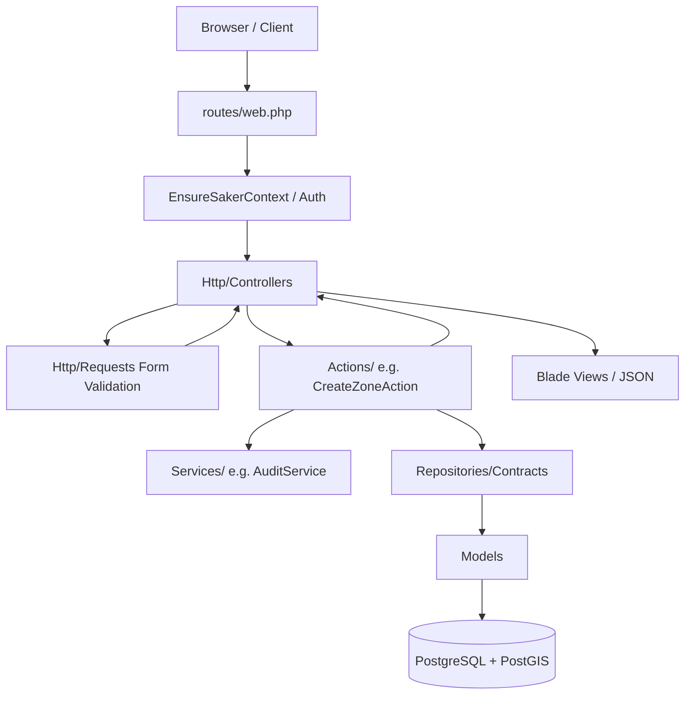
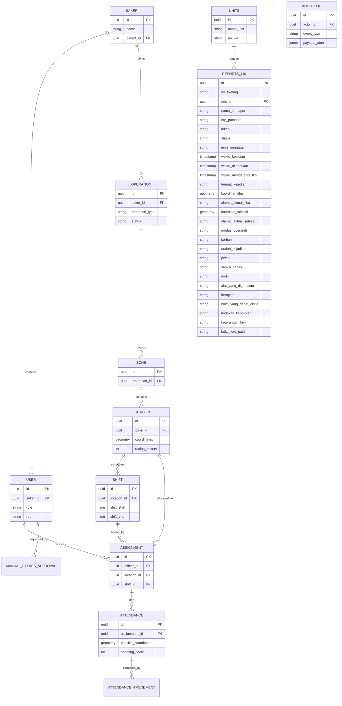
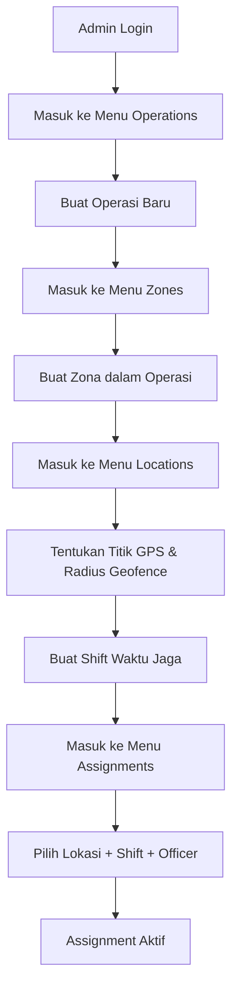

# Product Requirements Document (PRD) - Police Hazard

## 1. Executive Summary
Proyek **Police Hazard** adalah sistem command-and-control berbasis web yang dirancang khusus untuk instansi kepolisian (Indonesian law-enforcement agencies). Sistem ini dikembangkan menjadi sebuah **Mini Command Center** yang mengintegrasikan dua fungsi operasional utama secara berdampingan: monitoring kehadiran personel di lapangan secara real-time (modul Police Hazard) dan penanganan kedaruratan masyarakat (modul Fitur 110). Sistem ini mendigitalkan dan mengotomatiskan proses pencatatan kehadiran (check-in) personel kepolisian di lapangan (baik pos statis maupun patroli mobile) menggunakan validasi GPS (PostGIS geofencing), dokumentasi foto, dan spoofing detection, sekaligus menyajikan platform koordinasi penanganan laporan kedaruratan yang cepat dan akurat. Semua riwayat data penugasan, kehadiran, audit, dan laporan kedaruratan dijamin immutability-nya (tidak dapat diubah/dihapus) untuk keperluan audit.

---

## 2. Product Overview
### Tujuan Sistem
Menyediakan platform Mini Command Center untuk manajemen penugasan, monitoring kehadiran personel kepolisian secara real-time yang terdesentralisasi, serta koordinasi dan pelaporan layanan kedaruratan masyarakat (Fitur 110) secara global.

### Masalah yang Diselesaikan
*   **Pencatatan Manual:** Menghilangkan pencatatan kehadiran berbasis kertas yang rawan manipulasi.
*   **Ketidakakuratan Lokasi:** Memastikan personel benar-benar berada di lokasi penugasan melalui validasi geofence berlapis.
*   **Kecurangan (Spoofing):** Mendeteksi penggunaan aplikasi GPS palsu (mock locations) atau manipulasi waktu.
*   **Silo Data:** Menyediakan dashboard terpusat bagi pimpinan untuk melihat heat-map sebaran anggota di lapangan.

### Target Pengguna
1.  **Pimpinan/Administrator Pusat (God Admin):** Memantau keseluruhan data lintas wilayah.
2.  **Administrator Satuan Kerja (Saker Admin):** Mengatur penugasan, operasi, dan rute patroli di wilayah hukumnya masing-masing.
3.  **Petugas Lapangan (Officer):** Melakukan pelaporan kehadiran (check-in) dengan verifikasi lokasi dan foto.

---

## 3. Business Objective
*   Meningkatkan disiplin dan akuntabilitas personel kepolisian di lapangan.
*   Mempercepat respons operasional dengan mengetahui posisi aktual petugas secara real-time.
*   Membangun landasan data yang kuat dan tidak dapat disangkal (non-repudiation) untuk audit kinerja anggota.

---

## 4. Stakeholders
*   **Kepolisian Republik Indonesia (Polri)** sebagai institusi pengguna utama.
*   **Divisi Propam / Pengawas Internal** yang membutuhkan data audit yang valid dan tidak dapat diubah (immutable).
*   **Perwira Pengendali (Padal)** yang mengawasi titik-titik lokasi pengamanan.

---

## 5. User Roles (Berdasarkan Analisis Kode)

Berdasarkan `app/Models/User.php` dan rancangan sistem, terdapat beberapa peran (roles) utama:

| Role / Aktor | Description | Hak Akses & Mekanisme Isolasi Data |
| :--- | :--- | :--- |
| `god_admin` | Super Administrator | Memiliki akses penuh ke seluruh sistem tanpa batasan *tenant* (Saker). Dapat melihat log audit global. Dilindungi oleh middleware `god.admin`. |
| `saker_admin` | Administrator Wilayah | Hanya dapat mengelola data operasional (Operations, Zones, Locations, Assignments, Officers) dalam naungan Satuan Kerja (`saker_id`) miliknya. |
| `officer` | Petugas Lapangan | Memiliki akses terbatas untuk melihat jadwal penugasan dan melakukan *check-in* via aplikasi mobile. |
| **Operator Command Center (CC)** | Petugas Operator (CC) | Menginput data awal laporan kedaruratan 110, mencatat nomor tiketing, nama/NRP operator, menunjuk Unit Lapangan penanggung jawab, serta mengirim template pesan/link token via WhatsApp. |
| **Pamapta Lapangan** | Petugas Respon Cepat | Mengisi formulir pelaporan 110 di lapangan. Mengakses form via link token kriptografis tanpa proses login biasa (*Bypass Authentication / Bypass Guest Token*). |
| **Atasan / Pimpinan** | Supervisor Wilayah / Pusat | Memantau dashboard global untuk memantau data kehadiran (modul Police Hazard) dan seluruh status penanganan laporan 110. Khusus laporan 110, data bersifat global sehingga pimpinan dapat melihat semua laporan dari wilayah mana pun (*Bypass Row-Level Tenancy / SakerScope*). |

---

## 6. System Architecture

Sistem menggunakan framework **Laravel 13.7** dengan PHP **8.3**. Aplikasi menerapkan pola desain **Service-Action-Repository**, menjauhkan *business logic* dari Controller.

### Architecture Overview
1.  **Presentation Layer:** Blade templates dengan Tailwind CSS v4 dan Alpine.js v3.
2.  **Controller Layer:** Menerima request HTTP, mendelegasikan validasi ke FormRequest, lalu memanggil Action class.
3.  **Action Layer:** Menangani *business logic* spesifik (misal: `CreateOperationAction`). Action class bertugas sebagai _single source of truth_ untuk operasi transaksi.
4.  **Service Layer:** Menangani domain logic yang dapat digunakan ulang atau lintas-domain (misal: `GeofenceService` untuk kalkulasi spasial, `AuditService` untuk pencatatan log).
5.  **Repository Layer:** Menjadi jembatan abstraksi antara Action/Service dengan Eloquent ORM. Controller/Action selalu bergantung pada `*RepositoryInterface`.
6.  **Data Layer:** PostgreSQL dengan ekstensi PostGIS.

### Request Flow Diagram



### Data Isolation (Tenancy) Flow
Data pada modul Police Hazard diisolasi menggunakan `SakerScope` (Global Scope) pada Eloquent. Saat `saker_admin` login, middleware `EnsureSakerContext` memastikan setiap *query* otomatis ditambahkan `WHERE saker_id = ?`. Akses lintas-Saker akan menghasilkan `404 Not Found`.

Namun, untuk **Fitur 110 (Layanan Kedaruratan Masyarakat)**, data laporan pada model `reports_110` dikecualikan secara khusus dari penerapan `SakerScope` (*Bypass Row-Level Tenancy*). Hal ini bertujuan agar atasan/pimpinan dari satuan kerja wilayah mana pun dapat memantau penanganan insiden kedaruratan di seluruh wilayah hukum secara real-time demi efektivitas koordinasi komando.

---

## 7. Database Design

Database dirancang khusus untuk auditabilitas tinggi (immutability) dan pemrosesan geospasial menggunakan PostgreSQL + PostGIS. Semua tabel menggunakan UUID versi 7 sebagai primary key yang berurut secara kronologis (via trait `HasUuidV7`).

### ERD Diagram



### Database Overview (Tabel Kunci)

#### `sakers` (Organisasi/Tenant)
Hierarki satuan kerja (Polda -> Polres -> Polsek).
*   `id` (UUIDv7), `name` (String), `parent_id` (UUID, Nullable).

#### `users` (Pengguna)
Menyimpan akun login dan profil personel.
*   `saker_id` (UUID), `role` (Enum), `nrp` (String - Nomor Registrasi Pokok), `password` (Hashed).

#### `operations` (Operasi Lapangan)
*   `operation_type` (String: PH atau PATROL). Sifatnya *immutable* setelah zona pertama dibuat.

#### `locations` (Titik Tugas)
Titik spesifik dengan koordinat PostGIS.
*   `coordinates` (Geometry POINT 4326) - Koordinat titik.
*   `radius_meters` (Integer) - Batas toleransi geofence.
*   `minimum_officer` (Integer) - Kebutuhan personel minimum.

#### `assignments` (Penugasan)
Tabel pivot utama yang menghubungkan petugas dengan lokasi dan waktu tugas.
*   `officer_id` (UUID), `location_id` (UUID), `shift_id` (UUID).

#### `attendances` (Presensi / Check-in)
Tabel **Append-Only** (Immutable). Tidak memiliki `updated_at`.
*   `checkin_coordinates` (Geometry POINT 4326) - Lokasi aktual saat check-in.
*   `spoofing_score` (Integer) - Nilai probabilitas kecurangan.
*   `photo_path` (String) - Path foto dengan watermark.

#### `audit_logs` (Log Audit Global)
Tabel **Append-Only** untuk melacak setiap perubahan data pada sistem.
*   `event_type` (String), `actor_id` (UUID), `payload_before` (JSON), `payload_after` (JSON).

#### `units` (Unit Lapangan Respon Cepat)
Menyimpan data unit petugas lapangan penanggung jawab penanganan kedaruratan.
*   `id` (UUIDv7), `nama_unit` (String), `no_wa` (String - nomor WhatsApp untuk pengiriman token bypass).

#### `reports_110` (Laporan Kedaruratan 110)
Tabel untuk merekam insiden kedaruratan 110 dan status penangannnya. Bersifat semi-immutable untuk integritas data.
*   `id` (UUIDv7), `no_tiketing` (String, Unique - nomor tiket dari Polrestabes Semarang), `unit_id` (UUID - Foreign Key ke `units`).
*   `nama_pamapta` (String - nama petugas pamapta yang menyelesaikan laporan), `nrp_pamapta` (String - NRP petugas pamapta yang menyelesaikan laporan).
*   `token` (String, Unique - token bypass akses acak kriptografis).
*   `status` (Enum: `Butuh penanganan`, `Sedang penanganan`, `Sudah penanganan`).
*   `jenis_gangguan` (String), `waktu_kejadian` (Timestamp), `waktu_dilaporkan` (Timestamp), `waktu_mendatangi_tkp` (Timestamp, Nullable).
*   `tempat_kejadian` (Text - alamat/TKP awal yang diinput operator).
*   `koordinat_tiba` (Geometry POINT 4326, Nullable), `alamat_aktual_tiba` (Text, Nullable).
*   `koordinat_selesai` (Geometry POINT 4326, Nullable), `alamat_aktual_selesai` (Text, Nullable).
*   11 Kolom Tekstual Laporan Segera: `modus_operandi` (Text), `korban` (Text), `uraian_kejadian` (Text), `pelaku` (Text), `sanksi_sanksi` (Text), `motif` (Text), `alat_yang_digunakan` (Text), `kerugian` (Text), `bukti_yang_dapat_disita` (Text), `tindakan_kepolisian` (Text), `keterangan_lain` (Text).
*   `bukti_foto_path` (String, Nullable) - path foto bukti dokumentasi penanganan ter-watermark.

---

## 8. Feature Modules

Sistem dibagi menjadi beberapa modul utama yang diatur melalui *resource controllers*:

### Modul Operasi (Operations)
*   **Tujuan:** Mendefinisikan operasi besar yang menaungi titik-titik penugasan.
*   **Fitur:**
    *   *Create Operation:* Membuat operasi baru (PH / Patrol). Melibatkan validasi melalui `StoreOperationRequest` dan diolah oleh `CreateOperationAction`.
    *   *Edit Operation:* Memperbarui data operasi. Tipe operasi tidak dapat diubah apabila sudah memiliki relasi Zona (`UpdateOperationAction`).
    *   *Archive Operation:* Memindahkan operasi aktif menjadi arsip (history).

### Modul Zona (Zones)
*   **Tujuan:** Memecah sebuah operasi menjadi sub-wilayah operasional.
*   **Fitur:** CRUD standard. Pembuatan zona akan mengunci tipe pada operasi induk (`CreateZoneAction`).

### Modul Lokasi (Locations)
*   **Tujuan:** Mendefinisikan titik koordinat PostGIS dan batasan geofence untuk titik pengamanan/patroli.
*   **Fitur:** CRUD titik koordinat. Kolom koordinat akan terkunci (*locked*) secara otomatis jika lokasi tersebut telah memiliki rekaman *attendance* pertama.

### Modul Petugas (Officers)
*   **Tujuan:** Manajemen akun `officer` berdasarkan NRP (Nomor Registrasi Pokok) polisi.
*   **Fitur:** CRUD untuk menambah anggota di dalam lingkup Saker administrator.

### Modul Penugasan (Assignments)
*   **Tujuan:** Mengalokasikan personel (Officer) ke sebuah Lokasi dan Shift tertentu.
*   **Fitur:**
    *   *Wizard Creation:* Antarmuka berbasis AJAX untuk memilih Operasi -> Zona -> Lokasi -> Shift -> Petugas.
    *   *Cancel Assignment:* Membatalkan tugas yang sudah berjalan (soft validation).

### Modul Dashboard & Laporan (Reports)
*   **Tujuan:** Menyediakan overview kondisi lapangan secara real-time.
*   **Fitur:**
    *   *Map Overview:* Mengambil data koordinat via AJAX (`DashboardController@mapData`) untuk ditampilkan di peta Leaflet.js.
    *   *Export Reports:* Mengunduh rekapitulasi data *attendance* ke format tabular.

### Modul Audit Log
*   **Tujuan:** Menampilkan sejarah aktivitas sistem (siapa melakukan apa, dan kapan).
*   **Fitur:** Tampilan *read-only* (Grid) untuk log yang dicatat oleh `AuditService`.

### Modul Manajemen Unit Lapangan
*   **Tujuan:** Mengelola data Unit Lapangan Respon Cepat yang bertugas merespons panggilan darurat 110.
*   **Fitur:** CRUD Unit Lapangan (nama unit, nomor WhatsApp aktif).

### Modul Pencatatan Laporan (Operator CC)
*   **Tujuan:** Memfasilitasi Operator Command Center (CC) untuk meregistrasi laporan kedaruratan masuk.
*   **Fitur:**
    *   *Create Ticket:* Penginputan nomor tiketing manual (unik dari Polrestabes Semarang), nama & NRP operator, pemilihan Unit Lapangan penanggung jawab, Jenis Gangguan, Waktu Kejadian, Waktu Dilaporkan, dan Nama TKP awal.
    *   *Link Generation:* Otomatis membuat token acak kriptografis unik untuk laporan.
    *   *Share WhatsApp:* Tombol untuk mengirimkan pesan WhatsApp terformat ke nomor WhatsApp Unit Lapangan terpilih melalui integrasi link `wa.me`, berisi detail laporan dan tautan akses form lapangan dengan parameter token bypass.

### Modul Form Lapangan (Pamapta Lapangan)
*   **Tujuan:** Menyediakan antarmuka penulisan Laporan Segera oleh petugas Pamapta Lapangan di TKP tanpa perlu login (*Bypass Guest Token*).
*   **Fitur:**
    *   *GPS Tiba Verification (Fase Tiba):* Saat link dibuka pertama kali, pop-up modal "Tiba di Lokasi" mengunci seluruh form. Petugas wajib menekan tombol kedatangan, yang secara otomatis melacak GPS perangkat (HTML5 Geolocation API), mengisi otomatis `waktu_mendatangi_tkp`, koordinat tiba, dan melakukan reverse-geocoding untuk alamat tiba, lalu membuka kunci form.
    *   *Draft Saving (Fase Penanganan):* Pengisian 11 poin Laporan Segera (modus operandi, korban, pelaku, motif, kerugian, tindakan kepolisian, dll.) yang didampingi peta Leaflet.js interaktif. Terdapat tombol pembaruan GPS kustom di peta untuk melacak koordinat terkini petugas. Petugas bebas menyimpan draf laporan berulang kali tanpa mengunci form.
    *   *Lock & Complete (Fase Selesai):* Ketika status diubah menjadi "Completed", petugas wajib mengambil foto kamera langsung/unggah berkas. Sistem merekam koordinat selesai secara instan dan mengunci form menjadi read-only. Foto dokumentasi secara otomatis dibubuhi watermark koordinat, alamat selesai, waktu, dan logo via `WatermarkService`.
    *   *Edit Verification Code:* Form terkunci hanya dapat dibuka kembali untuk diedit oleh Pamapta dengan memasukkan kode verifikasi `no_tiketing` (Atasan & Operator kebal dari aturan penguncian ini).

### Siklus Status Tiket (Ticket Lifecycle)
Status tiket laporan 110 dikelola melalui siklus hidup (lifecycle) berikut:

| Status | Deskripsi | Kendali Form Pamapta |
| :--- | :--- | :--- |
| `Butuh penanganan` | Tiket baru dibuat oleh Operator CC dan belum ditindaklanjuti. | Form terkunci total oleh pop-up konfirmasi kedatangan "Tiba di Lokasi". |
| `Sedang penanganan` | Pamapta telah tiba di TKP, koordinat GPS tiba tercatat, dan sedang memproses laporan. | Kunci form terbuka. Petugas dapat mengisi 11 poin Laporan Segera dan menyimpan draf berkali-kali. |
| `Sudah penanganan` | Laporan telah selesai ditangani, foto dokumentasi diunggah, dan koordinat selesai terkunci. | Form terkunci permanen (read-only). Foto dibubuhi watermark. Pengeditan memerlukan kode verifikasi `no_tiketing`. |

---

## 9. Page Documentation

| Halaman | Route Name | Tujuan | Role | Fitur Khusus |
| :--- | :--- | :--- | :--- | :--- |
| **Login** | `login` | Autentikasi admin | Guest | Proteksi *Rate Limiting*. |
| **Dashboard** | `dashboard` | Peta Leaflet & rekap data | Admin | Peta dinamis dengan marker koordinat (AJAX). |
| **Operations** | `operations.index` | Daftar operasi lapangan | Admin | CRUD, tombol *Archive*. |
| **Zones** | `zones.index` | Daftar zona wilayah | Admin | CRUD. |
| **Locations** | `locations.index` | Daftar titik kordinat tugas | Admin | Input radius & peta koordinat. |
| **Officers** | `officers.index` | Database personel | Admin | CRUD berbasis NRP. |
| **Assignments** | `assignments.index` | Daftar riwayat penugasan | Admin | Wizard penugasan (AJAX berantai). |
| **Audit Logs** | `audit-logs.index` | Rekam jejak seluruh entitas | Admin, God Admin | View-only data JSON diff. |
| **Reports** | `reports.index` | Export laporan kehadiran | Admin | Tombol ekspor (CSV/Excel). |

---

## 10. API Documentation

> **Status Saat Ini:** Belum dapat diidentifikasi dari source code.

Berdasarkan analisis *source code* (pada `routes/web.php`, `bootstrap/app.php`, dan folder `app/Http/Controllers/`), **belum ada implementasi rute API (`routes/api.php`) maupun Controller API yang ditulis dalam proyek ini**. Endpoint Sanctum yang dirujuk dalam dokumen manual pengguna belum diimplementasikan di *codebase* pada fase ini.

---

## 11. Business Process

### User Journey: Penetapan Penugasan (Assignment)



### Workflow: Analisis Validasi Check-in (Domain Logic)
Meskipun API belum ada, *business logic* presensi dapat dianalisis dari layanan yang sudah tersedia (`GeofenceService`, `SpoofingDetectionService`).

```mermaid
flowchart TD
    Req[Request Check-in (Mock)] --> L1{Mock Location?}
    L1 -- Yes --> Flag1[Auto-Reject]
    L1 -- No --> L2{Jarak < Radius Geofence?}
    L2 -- No --> Reject1[Tolak: Di Luar Jarak]
    L2 -- Yes --> L3{Akurasi GPS < 3 meter?}
    L3 -- Yes --> Score1[Tambah Spoofing Score +1]
    L3 -- No --> L4{Waktu Shift Valid?}
    L4 -- No --> Reject2[Tolak: Di Luar Jadwal]
    L4 -- Yes --> Save[Simpan ke Attendances]
    Save --> Job[Trigger WatermarkService (Job)]
```

---

## 12. Functional Requirements (FR)

*   **FR-001 (Auth):** Sistem HARUS menyediakan portal login untuk admin wilayah (`saker_admin`) dan super admin (`god_admin`).
*   **FR-002 (Tenancy):** Sistem HARUS mengisolasi data operasi, zona, lokasi, dan petugas secara ketat berdasarkan `saker_id` dari admin yang sedang login.
*   **FR-003 (Operations):** Tipe operasi (`operation_type`) TIDAK BOLEH dapat diubah setelah zona pertama didaftarkan.
*   **FR-004 (Locations):** Sistem HARUS mengunci (`lock`) koordinat lokasi (Latitude/Longitude) setelah tercatat presensi pertama di lokasi tersebut.
*   **FR-005 (Geofence):** Sistem HARUS menggunakan kalkulasi PostGIS `ST_DWithin` dan `ST_Distance` untuk memvalidasi jarak petugas dari lokasi presensi.
*   **FR-006 (Spoofing):** Sistem HARUS melakukan skoring potensi *spoofing* berdasarkan indikator akurasi GPS dan deviasi waktu (timestamp drift).
*   **FR-007 (Audit):** Setiap aksi modifikasi (CRUD) HARUS dicatat ke dalam tabel `audit_logs` secara otomatis melalui `AuditService`.
*   **FR-008 (Immutability):** Tabel `attendances`, `audit_logs`, dan `attendance_amendments` HARUS bersifat *append-only* (tidak boleh diperbarui / dihapus).
*   **FR-009 (110 - Tiketing & Link):** Sistem HARUS menyediakan antarmuka bagi Operator CC untuk membuat tiket laporan kedaruratan 110 dengan `no_tiketing` unik, menentukan unit lapangan, dan memicu deep link WA (`wa.me`) yang menyertakan token bypass unik.
*   **FR-010 (110 - Bypass Auth):** Sistem HARUS mengizinkan petugas Pamapta Lapangan mengakses formulir laporan 110 via URL token kriptografis tanpa melalui login konvensional (*Bypass Guest Token*).
*   **FR-011 (110 - Kedatangan Lock):** Formulir Pamapta HARUS menampilkan pop-up kedatangan "Tiba di Lokasi" yang mengunci seluruh form. Kunci hanya terbuka setelah koordinat GPS kedatangan divalidasi dan direkam (`waktu_mendatangi_tkp`, `koordinat_tiba`, `alamat_aktual_tiba`).
*   **FR-012 (110 - Pelacakan GPS):** Halaman form penanganan 110 HARUS menampilkan peta Leaflet.js yang menunjukkan `koordinat_tiba` beserta tombol kustom untuk memperbarui posisi koordinat GPS jika petugas berpindah di sekitar TKP.
*   **FR-013 (110 - Selesai & Watermark):** Saat status diubah menjadi "Completed", sistem HARUS mewajibkan petugas mengunggah foto dokumentasi, mengunci koordinat selesai (`koordinat_selesai`, `alamat_aktual_selesai`), dan menempelkan watermark koordinat, alamat, logo, serta stempel waktu ke foto secara permanen via `WatermarkService`.
*   **FR-014 (110 - Penguncian Form):** Tiket berstatus "Sudah penanganan" HARUS dikunci secara read-only dari segala bentuk penyuntingan, kecuali jika Pamapta memasukkan kode verifikasi `no_tiketing` (Operator CC dan Atasan dikecualikan dari aturan penguncian ini).
*   **FR-015 (110 - Non-Tenant Monitoring):** Sistem HARUS mengecualikan model `reports_110` dari global scope `SakerScope` agar seluruh data laporan 110 dapat dipantau oleh atasan lintas wilayah secara terpusat.

---

## 13. Non Functional Requirements (NFR)

*   **NFR-001 (Database):** Sistem WAJIB menggunakan PostgreSQL 16+ dengan ekstensi PostGIS.
*   **NFR-002 (Primary Keys):** Seluruh primary key tabel menggunakan UUID versi 7 yang *time-ordered* untuk efisiensi indeksasi.
*   **NFR-003 (Performance):** Pengambilan radius geofence harus mengandalkan Spatial Index (`GIST`) pada sisi database.
*   **NFR-004 (UI/UX):** Antarmuka web harus responsif menggunakan Tailwind CSS v4.0.
*   **NFR-005 (Timezone):** Data internal disimpan dalam format `TIMESTAMPTZ` (UTC). Representasi di level aplikasi (berdasarkan `config/policehazard.php`) adalah WIB (`Asia/Jakarta`).
*   **NFR-006 (110 - Geolocation Accuracy):** Pembacaan koordinat tiba/selesai wajib menggunakan HTML5 Geolocation API dengan akurasi GPS terbaik yang didukung oleh perangkat keras (enableHighAccuracy).
*   **NFR-007 (110 - Token Entropy):** Token bypass laporan harus berupa string acak kriptografis dengan entropi tinggi (minimal 32 karakter hexadecimal/base64) untuk mencegah brute-force url.

---

## 14. Security Analysis

*   **Authentication & Session:** Ditangani standar oleh Laravel. Dilindungi dengan rate limiter maksimum 5 percobaan login gagal per 15 menit (`config/policehazard.php`).
*   **Authorization (Tenancy):** Menggunakan Global Scope Eloquent (`SakerScope`) yang diterapkan melalui trait `#[ScopedBy([SakerScope::class])]` pada model. Sangat kuat untuk mencegah IDOR (Insecure Direct Object Reference) lintas Saker.
*   **Bypass God Admin:** Role `god_admin` dipisahkan akses tenant-nya menggunakan *middleware* spesifik `SetGodAdminContext`.
*   **Validation:** Terdapat mitigasi kerentanan Mass-Assignment dengan secara ketat mendeklarasikan `$fillable` di seluruh model dan memvalidasi tipe input di folder `app/Http/Requests`.

---

## 15. Integration Analysis

### Eksternal Sistem yang Ditemukan:
1.  **OpenStreetMap & Leaflet.js**
    *   **Tujuan:** Merender peta secara visual pada halaman Dashboard dan Locations.
    *   **Alur Integrasi:** Di-load secara dinamis via NPM (`package.json`) dan dimuat di frontend (Blade) dengan koordinat dari controller (AJAX `/dashboard/map-data`).
2.  **Intervention Image v4 (WatermarkService)**
    *   **Tujuan:** Untuk membubuhkan teks metadata dan stempel waktu (watermark) pada foto *check-in* petugas secara *asynchronous*.
    *   **Status saat ini:** Layanan baru berupa kerangka kerja (*stub*). Implementasi aktual pada `WatermarkService::applyWatermark` hanya me-*return* *path* asli, belum memproses gambar.

---

## 16. Deployment Guide

### Requirement Server
*   **OS:** Ubuntu 22.04 LTS / Debian 12 (Disarankan).
*   **Web Server:** Nginx atau Apache.
*   **PHP:** Versi 8.3 ke atas (menggunakan PHP-FPM).
*   **Database:** PostgreSQL versi 16+ beserta ekstensi **PostGIS 3+**.
*   **Queue & Cache:** Redis Server.
*   **Supervisor:** Untuk menjalankan Laravel Horizon / Queue Workers secara kontinyu.

### Langkah Deployment Lengkap
1.  **Kloning Repositori & Instalasi Dependensi:**
    ```bash
    git clone <repository_url>
    cd police-hazard
    composer install --optimize-autoloader --no-dev
    npm install && npm run build
    ```
2.  **Konfigurasi Environment:**
    Salin file `.env.example` ke `.env`. Konfigurasikan koneksi `DB_CONNECTION=pgsql` beserta kredensial PostGIS, `CACHE_STORE=redis`, `QUEUE_CONNECTION=redis`.
3.  **Setup Database:**
    ```bash
    php artisan key:generate
    php artisan migrate --force
    php artisan db:seed --force
    ```
4.  **Konfigurasi Worker:**
    Jalankan queue daemon (untuk *WatermarkService* dan pengiriman notifikasi kelak). Disarankan menggunakan Laravel Horizon.
    ```bash
    php artisan horizon &
    ```
5.  **Optimasi Akhir:**
    ```bash
    php artisan optimize
    php artisan view:cache
    php artisan event:cache
    ```

---

## 17. Technical Analysis

Berdasarkan struktur *source code*, aplikasi ini menerapkan pola arsitektur tingkat lanjut tingkat enterprise:

*   **Repository Pattern:** Semua akses database (CRUD) dienkapsulasi di dalam folder `app/Repositories`. Controller tidak pernah memanggil `Model::create()` secara langsung, melainkan injeksi antarmuka (misal: `ZoneRepositoryInterface`). *Binding* diatur dalam `RepositoryServiceProvider`.
*   **Action Pattern:** Logika bisnis yang melibatkan banyak tahapan diabstraksikan menjadi aksi tunggal, misalnya `CreateZoneAction` dan `UpdateOperationAction`.
*   **Service Pattern:** Logika lintas batas (cross-cutting concerns) diisolasi, seperti `GeofenceService` untuk menghitung jarak spasial SQL murni tanpa membebankan controller, dan `AuditService` untuk penjejakan (tracing) log secara universal.
*   **Traits:** Ekstensif menggunakan `HasUuidV7` (menghasilkan UUID berdasarkan waktu mili-detik) dan `HasAuditTrail` (mekanisme otomatis hook Eloquent Model Observers).
*   **Custom Casts:** `PostgresArray` mengkonversi array native PostgreSQL (seperti `SMALLINT[]` pada `active_days` tabel Shift) menjadi representasi Array PHP secara presisi.

---

## 18. Risks and Limitations

1.  **API Absen:** Bagian paling krusial untuk aplikasi berbasis petugas lapangan (Mobile API untuk check-in via Sanctum) belum ditulis dalam basis kode ini.
2.  **Stub Services:** `NotificationService` dan `WatermarkService` serta `SpoofingDetectionService` baru merupakan kelas kerangka tanpa eksekusi logika mendalam (dijadwalkan di *Phase 3* sesuai komentar di kode).
3.  **Tidak Ada Jobs Terdaftar:** Walaupun tabel `jobs` sudah di-migrasi, kelas *job* (seperti `ProcessCheckinPhoto` yang disebutkan dalam desain) belum dibuat dalam folder `app/Jobs`.

---

## 19. Recommendations

*   **Refactoring & Completeness:** Segera implementasikan folder `routes/api.php` dan `app/Http/Controllers/Api` untuk menerima koordinat check-in dari aplikasi mobile.
*   **Database Immutability Enforcement:** Buat trigger SQL murni pada sisi database PostgreSQL pada tabel `attendances` dan `audit_logs` untuk memblokir `UPDATE` dan `DELETE` guna memastikan garansi immutability 100% jika sewaktu-waktu Eloquent dikelabui.
*   **Security:** Karena operasi `GeofenceService` mengandalkan PostGIS, pastikan *input koordinat* tervalidasi ketat (angka *Float/Double* absolut) guna menghindari kejanggalan konversi koordinat saat diteruskan sebagai raw binding di `DB::selectOne`.

---

## 20. Appendix

*   **PHP/Laravel Info:** Framework Laravel v13.7 beroperasi di atas PHP v8.3.
*   **Daftar Library Penting Frontend:**
    *   `tailwindcss` v4.0.0
    *   `alpinejs` v3.15
    *   `leaflet` v1.9
*   **Daftar Package Tambahan Backend:**
    *   `ramsey/uuid` v4.9 (Pembuatan UUID)
    *   `intervention/image` v4.0 (Manipulasi citra / watermark)
    *   `laravel/sanctum` v4.3 (Untuk autentikasi API di masa depan)
