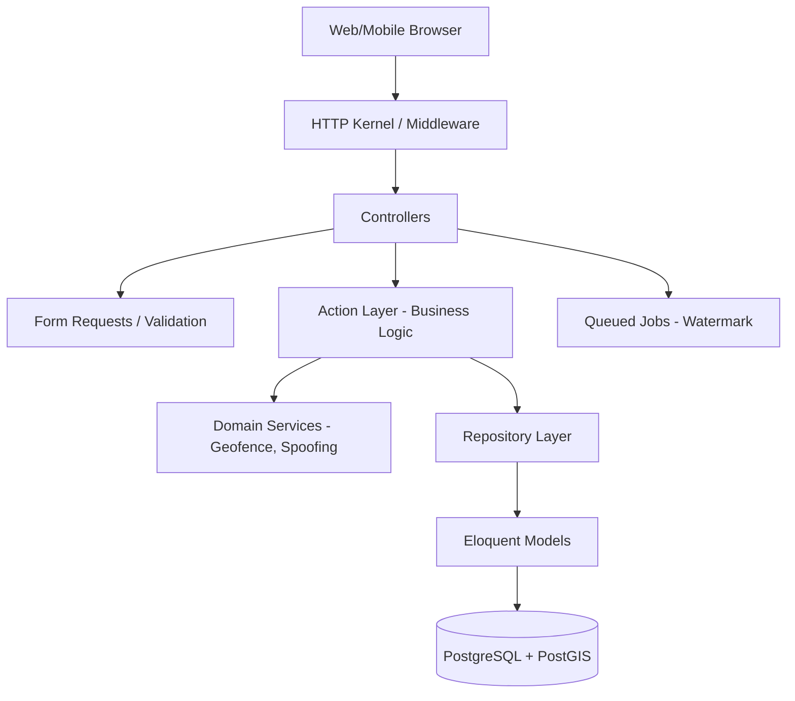
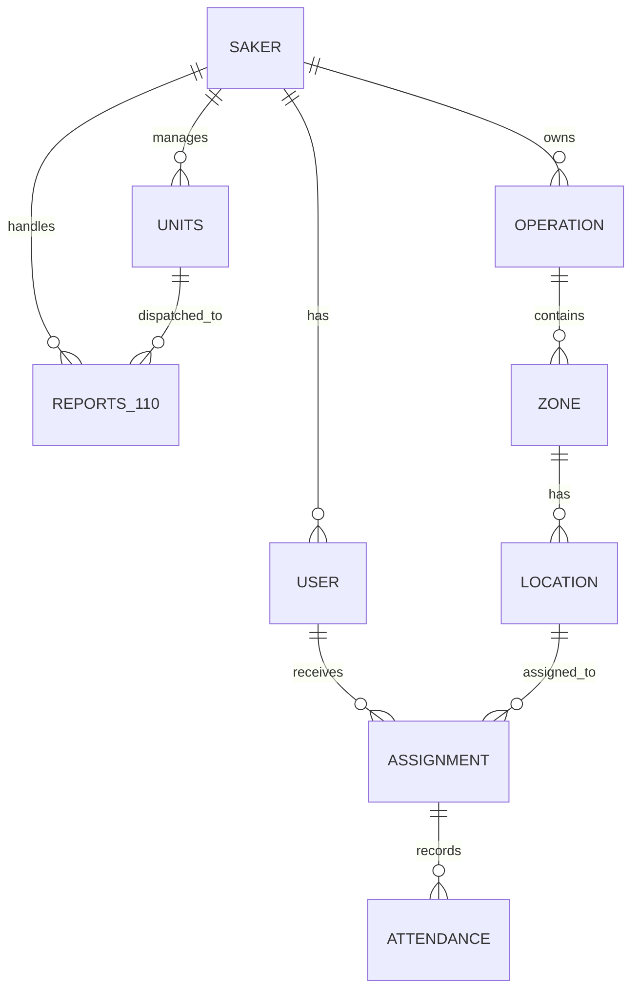
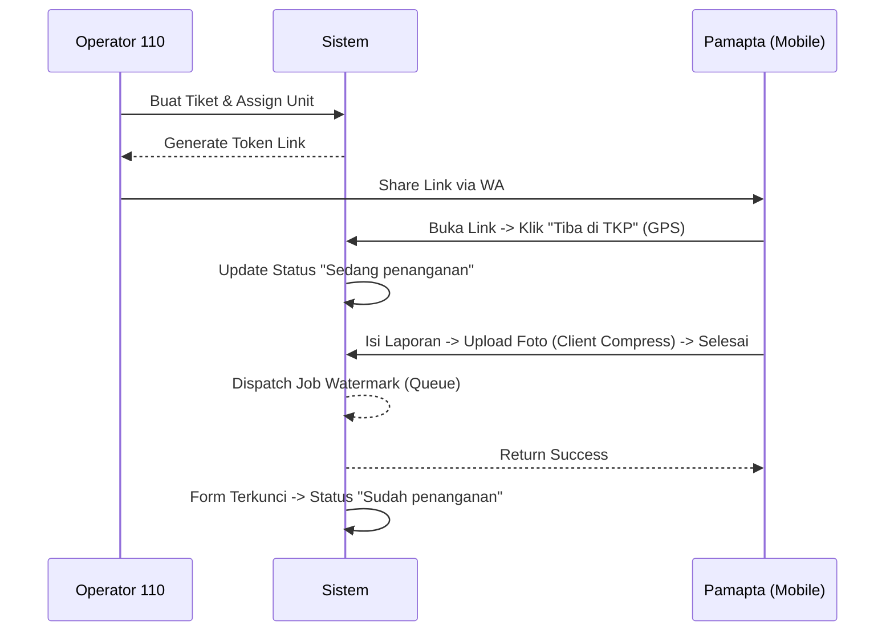
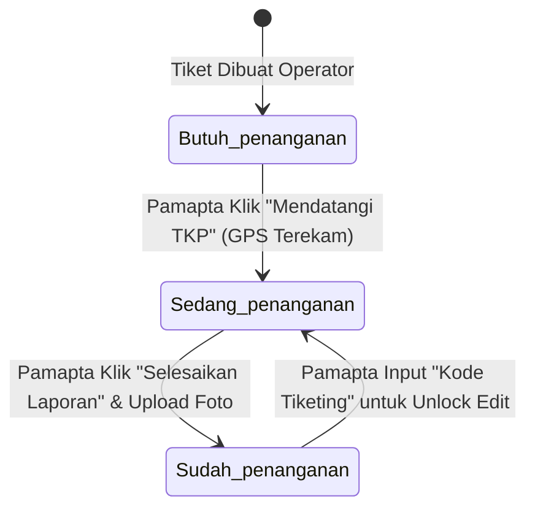
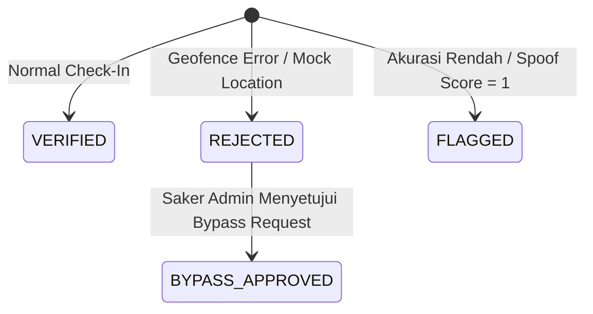

# Product Requirements Document (PRD) - Mini Command Center (Police Hazard & Fitur 110)

## 1. Executive Summary

### Nama Sistem
Mini Command Center (Police Hazard & Fitur 110)

### Tujuan Sistem
Mendigitalkan, mengotomatisasi, dan menyatukan pemantauan presensi personel kepolisian di lapangan (Police Hazard) serta sistem komando respons cepat penanganan kedaruratan masyarakat (Fitur 110) secara real-time dengan verifikasi geospasial yang ketat.

### Ringkasan Fungsi Utama
1. **Police Hazard (PH)**: Pemantauan presensi (check-in) dengan validasi Geofence (PostGIS) dan Anti-Spoofing.
2. **Fitur 110**: Pembuatan tiket darurat, penugasan unit, dan pelaporan penanganan langsung dari lapangan via tautan token (Bypass Token).

### Target Pengguna
1. **God Admin (Propam/Pusat)**: Audit kepatuhan nasional dan monitoring eskalasi.
2. **Saker Admin (Polres/Polsek)**: Manajemen operasi, zona, lokasi, dan personel wilayah.
3. **Operator 110 (Command Center)**: Penerima panggilan dan pembuat tiket kedaruratan.
4. **Pamapta / Officer**: Petugas lapangan yang melakukan check-in dan menindaklanjuti insiden.

### Value Proposition
Visibilitas real-time, jejak audit yang tidak dapat diubah (immutable), dan koordinasi darurat instan tanpa hambatan administratif bagi petugas di lapangan.

### Masalah yang Diselesaikan
* Manipulasi absensi fisik.
* Jeda komunikasi dalam respons darurat.
* Ketidakpastian bukti penanganan (diselesaikan dengan watermarking foto otomatis).

---

## 2. Business Background

### Latar Belakang Kebutuhan
Proses pemantauan personel secara manual (kertas/radio) tidak dapat divalidasi dan rawan manipulasi. Respons darurat masyarakat (110) sering terhambat oleh lambatnya diseminasi informasi ke unit terdekat.

### Pain Point
* Inakurasi data presensi.
* Tidak ada pengawasan visual (peta) atas sebaran petugas.
* Laporan penanganan insiden tidak terstandarisasi dan minim bukti valid.

### Proses Manual Sebelumnya
Petugas melapor tiba di titik via radio. Operator mencatat di buku mutasi. Laporan foto dikirim sporadis via WhatsApp tanpa verifikasi koordinat/waktu.

### Benefit Setelah Sistem
* Kepastian kehadiran 100% berbasis GPS.
* Pemantauan pergerakan unit secara live di peta komando.
* Bukti digital yang tak terbantahkan (tamper-proof watermarked photos).

---

## 3. Product Vision

Menjadi "Sistem Syaraf Pusat" operasional kepolisian yang memastikan setiap personel berada di titik yang tepat pada waktu yang tepat, serta merespons setiap panggilan darurat masyarakat dengan kecepatan dan transparansi absolut.

---

## 4. User Roles & Permissions

| Role Name | Deskripsi | Hak Akses | Batasan | Menu Akses | Fitur |
| :--- | :--- | :--- | :--- | :--- | :--- |
| **god_admin** | Super Admin (Propam) | Lintas Tenant (Global) | Tidak menangani operasional harian | Peta Pantauan 110 (Global), Audit Logs, Saker | Heatmap, Bypass Approval global, Full Audit |
| **saker_admin** | Admin Wilayah | Terisolasi per Saker | Hanya melihat/mengedit data di wilayahnya | Dashboard, Operasi, Lokasi, Shift, Officer, Assignments | Buat operasi, assign officer, lihat rekap, setujui bypass |
| **operator_110** | Operator CC | Terisolasi per Saker | Tidak bisa buat operasi PH | Peta Pantauan 110, Kelola Laporan | Buat tiket 110, pantau unit, ubah status laporan |
| **officer / pamapta** | Petugas Lapangan | Hanya data penugasan sendiri | Web Mobile Guest (Token) & Sanctum Auth | Mobile Web Officer | Check-in PH, Isi form Laporan 110 (Tiba & Selesai) |

---

## 5. Feature Inventory

### 5.1 Modul Organisasi & Tenancy
* **Tujuan**: Mengelola struktur institusi (Polda, Polrestabes, Polsek).
* **Flow**: God Admin membuat Saker -> Saker memiliki hierarki parent-child.
* **Validasi**: Saker code unik.
* **Business Rule**: Penghapusan diblokir jika Saker memiliki riwayat operasional.

### 5.2 Modul Perencanaan Pengamanan (Police Hazard)
* **Tujuan**: Merancang geofence (radius) patroli.
* **Input**: Nama, Operasi, Zona, Kordinat GPS, Radius.
* **Business Rule**: Kordinat lokasi terkunci (read-only) setelah ada 1 absensi untuk mencegah fraud.

### 5.3 Modul Presensi (Officer Check-In)
* **Tujuan**: Rekam kehadiran petugas.
* **Input**: GPS Device, Foto.
* **Validasi**: ST_DWithin (PostGIS), Anti-Spoofing (Mock Location detection).
* **Output**: Immutable attendance record.

### 5.4 Modul Operator 110
* **Tujuan**: Mencatat insiden masyarakat.
* **Input**: TKP, Jenis Gangguan, Assign Unit.
* **Output**: Bypass Token link untuk dikirim via WA ke unit lapangan.

### 5.5 Modul Form Lapangan Pamapta
* **Tujuan**: Pelaporan insiden dari lapangan.
* **Flow**: Klik link -> Konfirmasi Tiba (GPS) -> Isi Draft -> Upload Foto (Complete).
* **Business Rule**: Setelah Complete, form terkunci. Buka kembali butuh Kode Tiketing. Watermark foto diproses di *background queue*.

### 5.6 Peta Pantauan (Monitor Dashboard)
* **Tujuan**: Visualisasi live Leaflet.js.
* **Business Rule**: Hanya menampilkan status "Sedang penanganan" (Pulse Kuning) dan "Sudah penanganan" (Hijau Solid).

---

## 6. User Journey

### Alur Police Hazard (Absensi)
Saker Admin (Buat Operasi/Lokasi) -> Saker Admin (Assign Officer) -> Officer (Login Mobile Web) -> Officer (Check-In via GPS + Foto) -> Sistem (Validasi Geofence & Spoofing) -> Saker Admin (Lihat Rekap).

### Alur Laporan 110
Masyarakat (Telepon 110) -> Operator (Buat Tiket) -> Sistem (Generate Token Link) -> Operator (Share WA) -> Pamapta (Buka Link & Konfirmasi Tiba) -> Pamapta (Isi Laporan & Upload Foto) -> Sistem (Background Watermark) -> Peta Pantauan (Pin Hijau).

---

## 7. Functional Requirements

* **FR-001 [Manajemen Saker]**: Sistem harus dapat membuat hierarki Saker.
* **FR-002 [Isolasi Data]**: Kueri model harus selalu disaring menggunakan `SakerScope` sesuai `saker_id` user login.
* **FR-003 [Bypass 110]**: Peta Pantauan 110 harus dapat diakses `god_admin` secara global (tanpa SakerScope).
* **FR-004 [Check-In Geofence]**: Sistem menolak check-in jika jarak GPS device > radius `locations`.
* **FR-005 [Watermark 110]**: Sistem wajib membubuhkan watermark (NRP, waktu, GPS, tiket) pada foto laporan secara asynchronous (Queue).
* **FR-006 [Immutability]**: Tabel `attendances` dan `audit_logs` menolak kueri UPDATE/DELETE (via DB Rules).

---

## 8. Non Functional Requirements

* **Performance**: Upload foto dikompresi di sisi client (browser) sebelum dikirim (mengurangi payload dari 10MB ke 300KB). Pemrosesan watermark menggunakan background queue.
* **Security**: Sanctum untuk mobile, Auth Session untuk admin. Isolasi data RLS (Row Level Security) di DB.
* **Availability**: 99.5% uptime.
* **Scalability**: Stateless deployment.
* **Logging**: Semua perubahan entitas dicatat dalam `audit_logs`.
* **Data Retention**: Log tidak pernah dihapus.

---

## 9. System Architecture

* **Framework**: Laravel 13.x, PHP 8.3
* **Pola**: Domain-Driven, Service-Action-Repository pattern.
* **Isolasi**: Multi-tenant via `SakerScope` dan DB RLS.



---

## 10. Frontend Architecture

* **Framework**: Blade Templates, TailwindCSS v4, Alpine.js (State Management ringan).
* **Maps**: Leaflet.js (tanpa API Key, OpenStreetMap).
* **Modul Mobile**: Canvas API untuk image compression client-side (di form Pamapta). HTML5 Geolocation API (`enableHighAccuracy`).
* **Routing**: Sinkron (Laravel web routes).

---

## 11. Backend Architecture

* **Controllers**: Hanya untuk mengatur HTTP Request/Response (e.g. `Report110PamaptaController`, `DashboardController`).
* **Services**: Logika domain eksternal (e.g. `WatermarkService`, `GeofenceService`, `SpoofingDetectionService`).
* **Repositories**: Abstraksi kueri database untuk memisahkan ORM dari controller.
* **Jobs**: `ProcessCheckinPhoto` dan `ProcessReport110Watermark` (Asynchronous processing).
* **Middleware**: `god.admin`, `EnsureSakerContext` (Tenancy validation).
* **Global Scopes**: `SakerScope` (Sangat Kritikal).

---

## 12. Database Documentation

### `users`
Menyimpan akun login.
| Kolom | Tipe | Keterangan |
| --- | --- | --- |
| id | UUID (PK) | |
| saker_id | UUID (FK) | Relasi ke `sakers` |
| role | string | god_admin, saker_admin, operator_110, officer |

### `locations`
Titik patroli (Police Hazard).
| Kolom | Tipe | Keterangan |
| --- | --- | --- |
| id | UUID | |
| coordinates | GEOMETRY(POINT) | Titik spasial PostGIS |
| coords_locked | boolean | Mengunci kordinat pasca absensi |

### `reports_110`
Tiket laporan darurat masyarakat.
| Kolom | Tipe | Keterangan |
| --- | --- | --- |
| token | string | Token unik untuk bypass link |
| status | string | Butuh penanganan, Sedang penanganan, Sudah penanganan |
| koordinat_110 | GEOMETRY(POINT) | Lokasi aktual insiden |
| bukti_foto_path | string | Path AWS/MinIO gambar hasil watermark |

### `attendances`
Data check-in officer. **IMMUTABLE** (Tidak bisa di-update/delete).
| Kolom | Tipe | Keterangan |
| --- | --- | --- |
| checkin_coordinates | GEOMETRY(POINT) | Lokasi petugas saat absensi |
| spoofing_score | int | Deteksi fake GPS |

---

## 13. Entity Relationship Documentation

* `Saker` memiliki banyak `User`, `Operation`, `Report110`.
* `Operation` memiliki banyak `Zone`.
* `Zone` mencakup banyak `Location`.
* `Location` dialokasikan dalam banyak `Assignment`.
* `User` (Officer) menerima banyak `Assignment`.
* `Assignment` merekam satu/banyak `Attendance`.
* `Unit` (Armada) direferensikan oleh `Report110`. (Soft Deletes aktif pada `Unit` untuk menjaga FK integrity).

---

## 14. ERD (Entity Relationship Diagram)



---

## 15. API Documentation

Khusus Mobile Officer Flow & Pamapta (AJAX):

| Method | URL | Description | Auth | Validation |
| --- | --- | --- | --- | --- |
| POST | `/api/v1/auth/login` | Officer Login (Sanctum) | No | nrp, password |
| POST | `/laporan-110/isi/{token}/arrive` | Pamapta tiba di TKP | Token Bypass | lat, lng |
| POST | `/laporan-110/isi/{token}/complete` | Submit Laporan | Token Bypass | lat, lng, foto, data laporan |
| POST | `/laporan-110/isi/{token}/unlock` | Buka form terkunci | Token Bypass | kode_tiketing |

---

## 16. Business Rules

1. **PH Overlap Guard**: 1 Officer tidak boleh di-assign ke Shift & Hari yang sama.
2. **Immutability Absensi**: `attendances` tidak bisa diubah setelah tercatat. Jika error (misal GPS drift), gunakan mekanisme `Manual Bypass Approval` oleh Saker Admin.
3. **Location Lock**: Koordinat `locations` menjadi Read-Only segera setelah 1 check-in diverifikasi.
4. **Saker Scope**: Semua data difilter berdasarkan `saker_id`. **Pengecualian**: `reports_110` dapat dilihat oleh `god_admin` secara global.
5. **Form 110 Lock**: Form Pamapta (Token Link) otomatis terkunci (read-only) ketika status berubah menjadi "Sudah penanganan". Harus input `kode_tiketing` untuk membuka kembali (session based). Session `unlocked_110_{id}` dibersihkan otomatis setelah submit perbaikan.

---

## 17. Validation Rules

* **Foto Laporan 110**: Dikompresi otomatis via client-side (max 1200px, JPEG 0.7) sebelum diupload.
* **Geofence**: Diukur menggunakan `ST_DWithin`. Toleransi sesuai `radius_meters` di tabel `locations`.
* **Mock Location**: Flag `mock_location = true` langsung menyebabkan Auto-Reject.

---

## 18. Security Design

* **Authentication**: Web Session (Admin), Sanctum Token (Officer Mobile).
* **Authorization**: `SakerScope` Eloquent Trait. Row-Level Security (RLS) di level Database PostgreSQL.
* **Bypass Auth**: URL ber-token kriptografis tinggi (`Str::random(40)`) untuk Pamapta lapangan. URL dibagikan via WhatsApp.
* **Spoofing Detection**: Analisis metadata GPS (Timestamp drift, accuracy radius).
* **Immutability**: PostgreSQL RULES `DO INSTEAD NOTHING` pada operasi UPDATE/DELETE di tabel `attendances` dan `audit_logs`.

---

## 19. Third Party Integrations

* **OpenStreetMap (Nominatim)**: Reverse geocoding alamat (`fetchAddress` AJAX pada form Pamapta).
* **WhatsApp (wa.me)**: Redirect URL dinamis untuk membagikan Token Bypass dari Operator CC ke Pamapta.
* **AWS S3 / MinIO**: Object storage untuk menampung gambar ter-watermark (`bukti_foto_path`).

---

## 20. Configuration Requirements

| Variable | Required | Description |
| -------- | -------- | ----------- |
| `DB_CONNECTION` | YES | Harus `pgsql` (PostGIS required) |
| `QUEUE_CONNECTION` | YES | Rekomendasi: `database` atau `redis` untuk job watermark |
| `AWS_BUCKET` | NO | Untuk storage eksternal |
| `APP_TIMEZONE` | YES | Default: `Asia/Jakarta` |

---

## 21. Deployment Architecture

* **Server**: Nginx / Apache
* **PHP**: ^8.3 (Laravel 13.x)
* **Database**: PostgreSQL 16+ dengan ekstensi PostGIS 3.4+.
* **Queue**: Laravel Horizon atau `php artisan queue:listen` (Kritikal untuk memproses watermark foto laporan 110).
* **Storage**: Local public storage atau S3 Bucket.

---

## 22. Project Structure

* `app/Models/` : Entitas data dengan traits khusus (seperti `SakerScope`).
* `app/Http/Controllers/` : Mengelola trafik HTTP. Terpisah antara Web Admin dan API/Guest.
* `app/Jobs/` : Terdapat `ProcessReport110Watermark` & `ProcessCheckinPhoto` (Background Processing).
* `app/Services/` : Core business services (WatermarkService, GeofenceService).
* `database/migrations/` : Menggunakan tipe data spesifik `GEOMETRY(POINT, 4326)`.
* `resources/views/reports_110/` : Form Pamapta publik dengan integrasi Vue/Alpine & Canvas Compression.

---

## 23. Sequence Diagram (Laporan 110)



---

## 24. Edge Cases

* **Client Upload Timeout**: Terjadi jika foto kamera (10MB+) dikirim via 3G/Ngrok. *Mitigasi*: Client-side Canvas Image Compression memotong ukuran jadi ~300KB.
* **Unit Dihapus Saat Masih Menangani**: `reports_110` menggunakan Soft Deletes pada tabel `units` (menggunakan method `withTrashed()`) sehingga relasi historis tidak pecah (`Foreign Key Violation`).
* **Selesai Edit Tapi Form Masih Terbuka**: Session `unlocked_110_{id}` dibuang paksa `session()->forget()` di akhir controller submit agar form kembali terkunci aman.
* **Reverse Geocoding Gagal**: Fallback string statis "Alamat tidak ditemukan" agar tidak memblokir submit.

---

## 25. Technical Debt & Improvement Opportunities

* **Nominatim Rate Limit**: Reverse geocoding gratisan rawan terkena HTTP 429 jika traffic masif. *Rekomendasi*: Integrasi Google Maps API atau Self-hosted Pelias.
* **Storage Bloat**: Foto original dan watermarked menyita space besar seiring waktu. *Rekomendasi*: Implementasi log-rotation atau auto-archive foto ke S3 Glacier setelah 6 bulan.

---

## 26. Future Roadmap

1. **Dashboard Analytics Lanjut**: Menambahkan grafik AI sentimen masyarakat berdasarkan `uraian_kejadian`.
2. **Mobile App Native**: Membuat APK/AAB native agar bisa menggunakan background GPS tracking tanpa henti (Battery Optimized).
3. **Integrasi CCTV**: Memadukan titik lokasi dengan API RTSP CCTV Command Center terdekat.

---

## 27. AI Context Section

### System Summary
Laravel 13 application for law enforcement. Focus on Attendance (Police Hazard) and Emergency Ticketing (Fitur 110). Uses PostGIS for geospatial logic.

### Main Entities
`Saker` (Tenant), `User` (Officer/Admin), `Report110` (Emergency Ticket), `Attendance` (Immutable check-in log).

### Core Business Process
1. **PH**: Admin draws polygon/radius -> Assigns Officer -> Officer submits GPS/Photo -> PostGIS ST_DWithin validates -> Saved (Immutable).
2. **110**: Operator creates ticket -> Shares token link -> Officer clicks "Arrive" -> Submits draft -> Uploads photo -> Background Watermark Job -> Ticket Completed.

### Critical Files
* `app/Models/Concerns/SakerScope.php` (Never remove this logic).
* `app/Http/Controllers/Report110PamaptaController.php` (Guest flow for field officers).
* `resources/views/reports_110/pamapta_form.blade.php` (Includes client-side JS Canvas compression & Leaflet maps).
* `database/migrations/` (Look for GEOMETRY fields).

### Development Guidelines
* NEVER use `cat`, `grep`, `ls` shell commands; ALWAYS use native AI tools `grep_search` and `view_file`.
* If a file upload is involved, ALWAYS compress on client side if possible or push heavy logic (Watermark) to Laravel Queue.
* SoftDeletes (`withTrashed`) MUST be used on master data (like `units`) if referenced by historical transaction data (`reports_110`) to prevent DB foreign key crashes.

---

# 28. Complete Database Schema

## Nama Tabel: `users`
### Tujuan Tabel
Menyimpan identitas pengguna sistem, termasuk role dan relasi tenant (`saker_id`).
### Struktur Lengkap
| Kolom | Tipe | Nullable | Default | Unique | Keterangan |
| ----- | ---- | -------- | ------- | ------ | ---------- |
| id | UUID | No | `gen_random_uuid()` | Yes | PK |
| saker_id | UUID | No | - | No | Relasi tenant wilayah |
| name | VARCHAR(100) | No | - | No | Nama lengkap pengguna |
| nrp | VARCHAR(20) | No | - | Yes | Nomor Registrasi Pokok |
| email | VARCHAR(150) | Yes | - | Yes | |
| phone | VARCHAR(20) | Yes | - | No | |
| role | VARCHAR(20) | No | - | No | Enum: `god_admin`, `saker_admin`, `operator_110`, `officer` |
| safung | VARCHAR(50) | Yes | - | No | Satuan Fungsi |
| avatar_path | VARCHAR(255) | Yes | - | No | Path foto profil |
| password | VARCHAR(255) | No | - | No | Hash |
| is_active | BOOLEAN | No | TRUE | No | Status aktif user |
### Primary Key: `id`
### Foreign Key: `saker_id` (references `sakers.id`)
### Index: `idx_users_saker`, `idx_users_nrp`, `idx_users_role`
### Constraint: Pengecekan role IN ('god_admin', 'saker_admin', 'operator_110', 'officer')
### Business Rules: NRP harus unik. Role `god_admin` memiliki akses lintas tenant.

## Nama Tabel: `reports_110`
### Tujuan Tabel
Mencatat pelaporan masyarakat (Tiket 110) dan progress penanganannya oleh armada di lapangan.
### Struktur Lengkap
| Kolom | Tipe | Nullable | Default | Unique | Keterangan |
| ----- | ---- | -------- | ------- | ------ | ---------- |
| id | UUID | No | `gen_random_uuid()` | Yes | PK |
| no_tiketing | VARCHAR(50) | No | - | Yes | Kode tiket yang dibuat operator CC |
| unit_id | UUID | No | - | No | ID armada/unit yang bertugas |
| saker_id | UUID | No | - | No | Filter tenant |
| token | VARCHAR(64) | No | - | Yes | Token untuk URL public Pamapta |
| status | VARCHAR(30) | No | 'Butuh penanganan' | No | Enum Status |
| koordinat_110 | GEOMETRY(POINT) | Yes | - | No | PostGIS spasial lokasi penanganan |
| alamat_aktual_110 | TEXT | Yes | - | No | Alamat hasil reverse geocoding |
| jenis_gangguan | VARCHAR(150) | No | - | No | Label insiden (Curas, Laka, dsb) |
| waktu_kejadian | TIMESTAMPTZ | No | - | No | |
| waktu_dilaporkan | TIMESTAMPTZ | No | - | No | |
| waktu_mendatangi_tkp | TIMESTAMPTZ | Yes | - | No | Diisi saat pamapta klik "Tiba" |
| waktu_diselesaikan | TIMESTAMPTZ | Yes | - | No | Diisi saat laporan di-complete |
| tempat_kejadian | VARCHAR(250) | No | - | No | TKP awal yang dilaporkan warga |
| nama_pamapta | VARCHAR(150) | Yes | - | No | Nama pelapor di lapangan |
| bukti_foto_path | VARCHAR(500) | Yes | - | No | Path foto sesudah diwatermark |
### Primary Key: `id`
### Foreign Key: `unit_id` (references `units.id`), `saker_id` (references `sakers.id`)
### Index: `idx_reports_110_koordinat_110` (GIST)
### Constraint: Status IN ('Butuh penanganan', 'Sedang penanganan', 'Sudah penanganan')
### Business Rules: Status tidak bisa mundur. `koordinat_110` hanya diisi ketika status menjadi `Sedang penanganan`.

## Nama Tabel: `units`
### Tujuan Tabel
Menyimpan daftar armada (mobil patroli/tim) yang dapat di-assign ke tiket 110.
### Struktur Lengkap
| Kolom | Tipe | Nullable | Default | Unique | Keterangan |
| ----- | ---- | -------- | ------- | ------ | ---------- |
| id | UUID | No | `gen_random_uuid()` | Yes | PK |
| saker_id | UUID | No | - | No | Kepemilikan unit berdasar wilayah |
| nama_unit | VARCHAR(150) | No | - | No | Cth: "Patroli 01" |
| no_wa | VARCHAR(20) | No | - | No | Nomor WA yang dikirimi token link |
| deleted_at | TIMESTAMPTZ | Yes | - | No | Soft Deletes |
### Primary Key: `id`
### Business Rules: Dihapus secara soft delete agar tidak melanggar foreign key di tabel historis `reports_110`.

## Data Dictionary
### `users.role`
| Value | Label | Deskripsi |
| --- | --- | --- |
| `god_admin` | Super Admin | Akses seluruh sakers dan heatmap global |
| `saker_admin` | Admin Wilayah | Admin operasional untuk 1 wilayah Saker |
| `operator_110` | Operator | Pembuat tiket insiden (Command Center) |
| `officer` | Petugas | Personel lapangan yang melakukan check-in |

### `reports_110.status`
| Value | Label | Deskripsi |
| --- | --- | --- |
| `Butuh penanganan` | Menunggu | Tiket baru dibuat oleh operator, pamapta belum buka link |
| `Sedang penanganan`| Penanganan | Pamapta telah tiba di lokasi (koordinat dikunci) |
| `Sudah penanganan` | Selesai | Form dikirim komplit berserta foto bukti watermark |

### `assignments.status`
| Value | Label | Deskripsi |
| --- | --- | --- |
| `pending` | Belum Dimulai | Penugasan dibuat, belum jadwalnya |
| `active` | Berjalan | Jadwal penugasan sedang berlangsung (hari ini) |
| `completed` | Selesai | Penugasan selesai / waktu shift habis |
| `cancelled` | Dibatalkan | Penugasan dibatalkan secara manual oleh admin |

## Database Dependency Map
```text
sakers
├── users (role: god_admin, saker_admin, operator_110, officer)
├── operations
│   └── zones
│       └── locations
│           └── shifts
├── units
└── reports_110 (references units)

users
└── assignments
    └── attendances
    └── audit_logs (actor_id)

locations
└── assignments

assignments
└── attendances
```

---

# 29. Permission Matrix

| Resource / Fitur | Action | God Admin | Saker Admin | Operator 110 | Officer / Pamapta |
| --- | --- | --- | --- | --- | --- |
| **Sakers** | CRUD | ✓ (Semua) | ✗ | ✗ | ✗ |
| **Operations** | CRUD | ✓ (Semua) | ✓ (Saker Sendiri) | ✗ | ✗ |
| **Locations** | CRUD | ✓ (Semua) | ✓ (Saker Sendiri) | ✗ | ✗ |
| **Units** | CRUD | ✓ (Semua) | ✓ (Saker Sendiri) | ✓ (Saker Sendiri) | ✗ |
| **Reports 110** | Create | ✗ | ✗ | ✓ | ✗ |
| **Reports 110** | Update | ✓ (Unlock) | ✓ (Unlock) | ✓ | ✓ (Guest Token) |
| **Reports 110** | Delete | ✓ | ✓ | ✓ | ✗ |
| **Dashboard** | View | ✓ (Semua) | ✓ (Saker Sendiri) | ✗ | ✗ |
| **Peta Pantauan 110**| View | ✓ (Global) | ✓ (Saker Sendiri) | ✓ (Saker Sendiri) | ✗ |
| **Heatmap Global** | View | ✓ | ✗ | ✗ | ✗ |
| **Audit Logs** | View | ✓ (Global) | ✗ | ✗ | ✗ |

## Authorization Flow
1. **Middleware `auth:web`**: Memastikan user login menggunakan Session.
2. **Middleware `auth:sanctum`**: Memastikan Officer login menggunakan API token.
3. **Middleware `god.admin`**: Pengecekan `Auth::user()->role === 'god_admin'`. Rute seperti `/sakers` dan `/heatmap` hanya bisa diakses via middleware ini.
4. **`SakerScope` (Global Scope)**: Ter-bind secara otomatis pada Models (seperti `Operation`, `Zone`, `Location`, `Assignment`, `Report110`). Secara otomatis menambahkan klausul `WHERE saker_id = ?` sesuai Saker ID dari user yang sedang login. **Pengecualian**: `Report110` mengabaikan SakerScope HANYA untuk `god_admin` agar pimpinan bisa melihat peta insiden skala nasional.
5. **Guest Token (`Bypass Token`)**: Laporan 110 Pamapta tidak mewajibkan login, namun harus menggunakan parameter unik `{token}` yang di-generate sistem (Bypass Auth).

## Tenant Isolation Matrix

| Entity | Tenant Scoped (`SakerScope`) | Global Access |
| --- | --- | --- |
| `Operation`, `Zone`, `Location` | Ya (dibatasi per `saker_id`) | `god_admin` |
| `Assignment`, `Attendance` | Ya (dibatasi per `saker_id`) | `god_admin` |
| `Unit` | Ya (dibatasi per `saker_id`) | `god_admin` |
| `Report110` | Ya (dibatasi per `saker_id`) | **`god_admin` Bypass Global** |
| `AuditLog` | Ya (dibatasi per `saker_id`) | `god_admin` |

---

# 30. Screen Documentation

## Nama Halaman: Dashboard (Admin)
### URL: `/dashboard`
### Role Akses: `saker_admin`, `god_admin`
### Tujuan: Melihat ringkasan data, grafik absensi (Police Hazard).
### API yang Dipanggil: `/dashboard/map-data` (AJAX Leaflet)

## Nama Halaman: Operator 110 - Peta Pantauan
### URL: `/operator-110/monitor`
### Role Akses: `operator_110`, `saker_admin`, `god_admin`
### Tujuan: Memantau live tracking pergerakan penanganan laporan darurat.
### Data Source: `reports_110` (Hanya status `Sedang penanganan` dan `Sudah penanganan`)

## Nama Halaman: Form Laporan Pamapta (Token Link)
### URL: `/laporan-110/isi/{token}`
### Role Akses: `Guest` (Pamapta lapangan)
### Tujuan: Pelaporan hasil penanganan darurat tanpa login.
### Action Tersedia: "Tiba di TKP" (Membaca GPS), "Simpan Sementara", "Selesai Laporan" (Mengirim Foto Bukti).
### Error Handling: Jika status sudah "Sudah penanganan", form terkunci (Read-Only) kecuali di-unlock menggunakan `kode_tiketing`.

## Sitemap
```text
Admin Web
├── Dashboard
├── Master Data
│   ├── Saker (God Admin Only)
│   ├── Unit Armada
│   └── Officer
├── Perencanaan Operasi (Police Hazard)
│   ├── Operations
│   ├── Zones
│   ├── Locations
│   └── Assignments
├── Fitur 110
│   ├── Buat Tiket & Manajemen
│   └── Peta Pantauan 110 (Monitor)
└── Laporan & Audit
    ├── Rekapitulasi
    ├── Heatmap Global (God Admin Only)
    └── Audit Logs

Public Web (Mobile)
└── Form Pamapta (via Token Link)
```

---

# 31. State Machine Documentation

## Report110 State Machine


* **Trigger & Validasi**: Form berubah dari *Disabled* menjadi *Editable* setelah konfirmasi kedatangan. Koordinat dikunci (read-only) dan tak bisa diganti manual setelah kedatangan terekam. Saat selesai, form otomatis masuk mode *Read-Only* dan membuang session.

## Attendance State Machine (Police Hazard)


* **Immutability**: Entri `Attendance` bersifat *Append-Only* di tingkat Postgre Rules. Tidak bisa di `UPDATE` atau `DELETE`. Segala perbaikan (seperti Byapss) akan membuat *row* baru yang bertautan.

---

# 32. AI Developer Guide

## Project Mental Model
Aplikasi ini berdiri pada dua pilar utama:
1. **Modul Operasi Taktis (Police Hazard)**: Fokus pada pengaturan *Geofence* spasial (Lokasi), jadwal penugasan (Shift), dan presensi absensi berbasis GPS yang dikawal oleh algoritma anti-spoofing dan arsitektur database *immutable*.
2. **Modul Kedaruratan (Fitur 110)**: Berfokus pada penanganan insiden kilat (Rapid Response) tanpa otentikasi login klasik (menggunakan *Token Link*). Menekankan validasi lapangan melalui *Watermarking Foto* secara asinkron.

## Core Business Rules (Wajib Dipatuhi)
* **Attendance Immutable**: Anda tidak boleh membuat query `UPDATE` atau `DELETE` pada tabel `attendances` & `audit_logs`.
* **Tenant Isolation**: Semua Model memiliki global scope `SakerScope`. Jangan sekali-kali mencoba membypass *Scope* ini (seperti memakai `withoutGlobalScopes()`) tanpa alasan super absolut (seperti Heatmap `god_admin`).
* **Location Lock**: Koordinat (`ST_POINT`) pada tabel `locations` tidak bisa diubah pasca-tercatatnya absensi pertama.
* **Soft Deletes Reference**: Jangan melakukan hard delete pada master tabel (seperti `units`) yang *foreign-key* nya dipakai oleh tabel historis transaksional (`reports_110`). Selalu gunakan Soft Deletes.

## Architectural Constraints
* **Logic di Controller DILARANG**: Semua komputasi geospasial harus berada di `Services` (cth: `GeofenceService.php`). Logika bisnis penyimpanan yang kompleks (cth: membuat operasi + zona sekaligus) harus di `Actions`. Controller HANYA menerima dan membalas HTTP Response.
* **Upload Image / Watermark**: Karena PHP/Laravel memproses request secara sinkron, memproses *Watermark Intervention* pada gambar besar di Controller akan menyebabkan Time-Out (terutama untuk HP yang di-sharing via NGROK). Semua manipulasi gambar besar **HARUS** diproses asinkron menggunakan *Laravel Queues* (Cth: `ProcessReport110Watermark`).
* **Client-Side Image Compression**: Form pelaporan wajib menggunakan HTML5 `Canvas` untuk kompresi file menjadi WebP/JPEG kualitas rendah *sebelum* memanggil POST submit.

## Important Files
| File | Fungsi | Critical Level |
| --- | --- | --- |
| `app/Models/Concerns/SakerScope.php` | Tenancy Global Scope logic. | **Super Critical** |
| `app/Services/SpoofingDetectionService.php` | Logika deteksi manipulasi Absensi GPS. | Critical |
| `app/Http/Controllers/Report110PamaptaController.php` | Controller public untuk flow 110. | High |
| `resources/views/reports_110/pamapta_form.blade.php` | Form UI public Pamapta yang mengandung logika SPA ringan (Alpine.js) dan JS Compression. | High |

## Common Pitfalls (Sering Gagal)
❌ Menghapus/Membypass `SakerScope` tanpa sadar.
❌ Mencoba mengubah tabel `attendances` dan mendapatkan error `DO INSTEAD NOTHING` dari Postgre.
❌ Melupakan penggunaan *Background Job* saat merekayasa fitur Watermark, yang menyebabkan sistem loading berputar-putar tanpa akhir pada jaringan seluler.
❌ Mencoba mengeksekusi `DELETE` pada `units` dan langsung terkena *Foreign Key Violation* (Harus menggunakan *SoftDeletes*).

## AI Quick Start Guide (The 2-Minute Read)
Sistem ini adalah **Laravel 13 + PostGIS Application** untuk kepolisian. Memiliki dua fungsi: *Absensi Patroli Berbasis GPS* (Tabel `attendances`, Immutable) dan *Sistem Tiketing Darurat 110* (Tabel `reports_110`, URL Token). 
Role terbagi berdasarkan hierarki kewilayahan/tenant (*Saker*). Setiap Model disekat ketat oleh `SakerScope`. 
**Aturan Utama**: JANGAN PERNAH menyentuh query `UPDATE`/`DELETE` di tabel kehadiran, dan JANGAN menaruh logika komputasi / pengolahan gambar (Watermark) secara sinkron (blocking) di controller—selalu gunakan *Jobs (Queues)*. Gunakan `grep_search` & `view_file` (Bukan bash tools) saat melakukan inspeksi.
