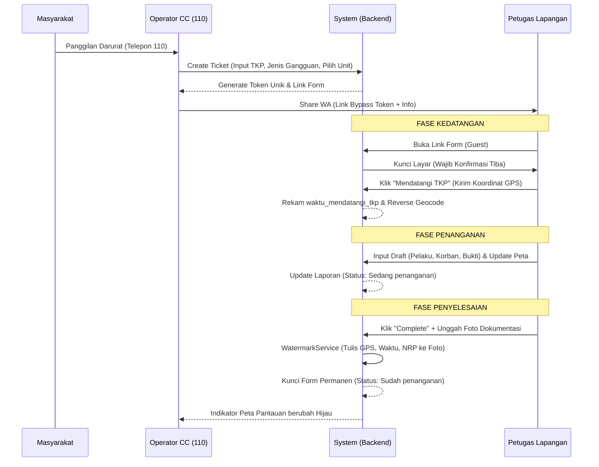
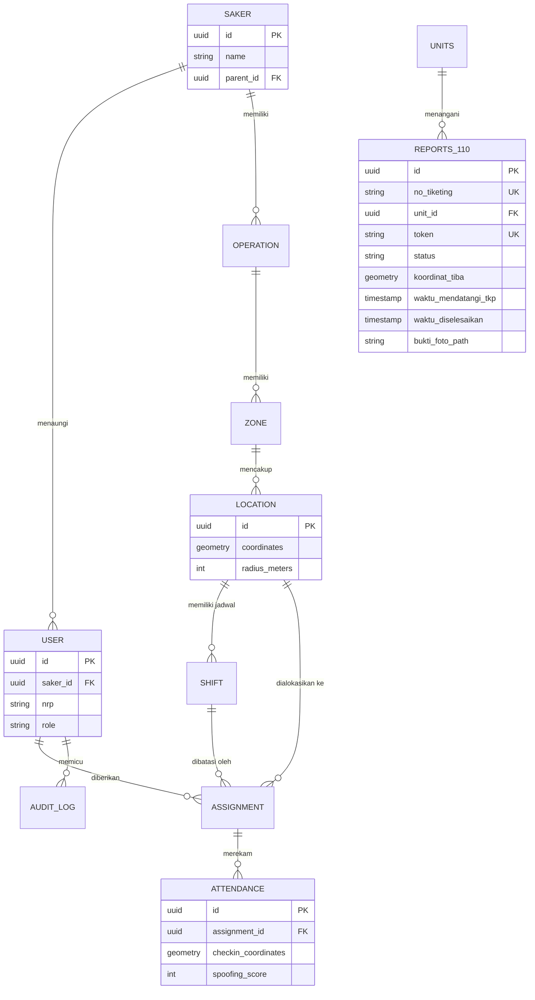

# Product Requirements Document (PRD) - Mini Command Center (Police Hazard & Fitur 110)

---

## 1. Executive Summary & Product Overview

### Latar Belakang & Visi
Proyek **Mini Command Center** berevolusi dari sebuah inisiatif pencatatan presensi digital (Sistem Wajib Lapor / Police Hazard) menjadi platform komando dan kontrol terpadu berskala *Enterprise* bagi instansi penegak hukum kepolisian (Indonesian Law-Enforcement Agencies). Visi utamanya adalah mendigitalkan, mengotomatisasi, dan menyatukan dua pilar operasional kepolisian secara berdampingan: 
1. **Modul Police Hazard**: Pemantauan presensi dan pergerakan personel kepolisian di lapangan (titik rawan, pos statis, dan rute patroli) secara *real-time* dengan verifikasi geospasial yang ketat.
2. **Modul Fitur 110**: Sistem komando respons cepat penanganan kedaruratan masyarakat yang memungkinkan operator dan pasukan lapangan (*Pamapta*) berkoordinasi secara mulus, akurat, dan nirbatas.

### Masalah yang Diselesaikan
* **Modul Police Hazard**:
  * **Inakurasi & Manipulasi Presensi:** Menghilangkan kelemahan sistem kertas konvensional dengan validasi *Geofence* (PostGIS) dan proteksi *Anti-Spoofing* (deteksi *mock location*).
  * **Silo Data Operasional:** Mengatasi ketidaktahuan pimpinan terhadap posisi riil pasukan pengamanan secara *real-time* saat terjadi eskalasi massa.
* **Modul Fitur 110**:
  * **Respons Darurat Lambat:** Menghilangkan jeda waktu koordinasi melalui otomatisasi pembuatan tautan penanganan (*Bypass Token*) yang langsung terintegrasi dengan WhatsApp Unit Lapangan.
  * **Ketidakjelasan Bukti Penanganan:** Memastikan setiap insiden yang dinyatakan "Selesai" memiliki dokumentasi visual yang valid berkat otomatisasi *Watermarking* (koordinat, alamat aktual, stempel waktu, dan identitas petugas).

### Target Pengguna & Stakeholders
1. **Pimpinan Pusat / Propam (God Admin):** Membutuhkan *overview* global (lintas wilayah) untuk audit kepatuhan, evaluasi kinerja komprehensif, serta pemantauan titik-titik eskalasi darurat secara nasional/regional.
2. **Administrator Wilayah / Polres (Saker Admin):** Bertanggung jawab merancang Operasi, mendistribusikan personel ke Lokasi/Zona, dan mengawasi laporan 110 yang secara eksklusif terjadi di wilayah hukumnya.
3. **Operator Command Center (CC):** Agen garda terdepan yang menerima panggilan masuk masyarakat, membuat tiket insiden, dan menugaskan Unit Lapangan untuk bertindak.
4. **Petugas Lapangan & Pamapta (Officer):** Personel yang mengeksekusi pengamanan (*check-in* Police Hazard) dan menindaklanjuti insiden (melakukan laporan *Draft* hingga *Complete* pada Fitur 110) langsung dari *smartphone* mereka.

---

## 2. User Roles & Authorization Matrix

Sistem ini didesain dengan hierarki peran yang spesifik, memadukan autentikasi konvensional (Sesi Login) dan autentikasi asimetris (*Token Bypass* untuk kecepatan di lapangan).

### Deskripsi Role Pengguna
* `god_admin` (Super Administrator): Puncak hierarki sistem. Memiliki visibilitas tanpa batas lintas *tenant* (Saker) untuk keperluan pengawasan global dan audit absolut.
* `saker_admin` (Administrator Wilayah): Pemimpin operasional di tingkat wilayah hukum (POLDA/POLRESTABES/POLSEK). Hanya memiliki wewenang pada data di dalam wilayah kekuasaannya.
* `operator_110` (Operator Command Center): Staf operator komunikasi yang berwenang membuka dan merespons tiket kedaruratan awal, namun tidak berwenang merancang operasi kepolisian.
* `officer` / `pamapta` (Petugas Lapangan): Aktor eksekusi. Melakukan *check-in* presensi dan menyelesaikan tiket 110.

### Tabel Matriks Hak Akses

| Fitur / Modul | `god_admin` | `saker_admin` | `operator_110` | `pamapta` / `officer` (Lapangan) | Sifat Isolasi Data (Tenancy) |
| :--- | :--- | :--- | :--- | :--- | :--- |
| **Login & Dashboard** | Full Access | Akses Wilayah | Akses Wilayah | Akses Mobile/Guest | Terisolasi via `SakerScope` |
| **Manajemen Operasi & Zona** | Read, Create, Update | Read, Create, Update | No Access | No Access | Terisolasi via `SakerScope` |
| **Manajemen Lokasi & Shift** | Read, Create, Update | Read, Create, Update | No Access | No Access | Terisolasi via `SakerScope` |
| **Manajemen Officer (NRP)** | Read, Create, Update | Read, Create, Update | No Access | No Access | Terisolasi via `SakerScope` |
| **Distribusi Penugasan** | Read, Create, Cancel | Read, Create, Cancel | No Access | No Access | Terisolasi via `SakerScope` |
| **Pemantauan Map Global 110** | View All Regions | View Region Only | View Region Only | No Access | **Global / Pengecualian SakerScope** |
| **Manajemen Unit Lapangan**| Read, Create, Update | Read, Create, Update | Read, Create, Update| No Access | Terisolasi via `SakerScope` |
| **Penerbitan Tiket 110** | Read, Delete | Read, Delete | Read, Create, Update| No Access | **Global / Pengecualian SakerScope** |
| **Pengisian Form Tiba & Draft**| No Access | No Access | No Access | **Create/Update via Bypass Token**| **Bypass Auth** |
| **Penyelesaian Laporan (Complete)**| No Access | No Access | No Access | **Update via Bypass Token** | **Bypass Auth** |
| **Log Audit (Immutability)** | View All Logs | View Region Logs | No Access | No Access | Terisolasi via `SakerScope` |

---

## 3. System Architecture & Data Flow

### Pola Arsitektur Kode (Enterprise Backend Design)
Aplikasi dibangun di atas pondasi **Laravel 13.x** dan **PHP 8.3** dengan menerapkan arsitektur berorientasi domain (*Domain-Driven Architecture*):
1. **Presentation Layer:** Antarmuka responsif menggunakan `Blade Templates`, `Tailwind CSS v4.0`, dan interaktivitas peta spasial dengan `Leaflet.js`.
2. **Controller Layer:** Menjadi pengarah *traffic* HTTP semata. Validasi input sepenuhnya didelegasikan kepada `FormRequest`.
3. **Action Layer:** (*Single Source of Truth* transaksi). Aksi bisnis kompleks, seperti membuat operasi atau memvalidasi kordinat presensi, dienkapsulasi dalam kelas mandiri (contoh: `CreateReport110Action`, `UpdateOperationAction`).
4. **Service Layer:** Menampung logika pendukung yang bisa digunakan ulang (contoh: `GeofenceService` untuk komputasi spasial murni, `WatermarkService` untuk pemrosesan citra digital, `AuditService` untuk penjejakan perubahan).
5. **Repository Layer:** Pemisah (*Abstraction Layer*) antara logika bisnis dan kueri *Eloquent ORM*. Memastikan kode pengontrol tidak bergantung langsung pada skema database.

### Mekanisme Isolasi Data (Multi-Tenancy & Bypass)
Sistem ini menggunakan arsitektur *Single Database, Multi-Tenant* berbasis hirarki Satuan Kerja (Saker).
* **Global Scope Filtering:** Modul Police Hazard (Operasi, Lokasi, Shift, Presensi) diamankan menggunakan `SakerScope` (Global Scope). Setiap kueri database secara gaib disisipkan `WHERE saker_id IN (...)` yang membatasi pembacaan data hanya pada hierarki Saker milik Admin yang *login*.
* **Pengecualian Filter (Global Data Bypass):** Khusus pada Modul 110 (Tabel `reports_110`), `SakerScope` secara sengaja **dilepas/dieksklusi**. Hal ini krusial agar pimpinan tertinggi (contoh: *God Admin* atau komandan wilayah) dapat memonitor *Dashboard Peta Pantauan 110* dan merespons seluruh insiden darurat secara global dan tanpa batas wilayah (Cross-Border Incident Monitoring).

### Diagram Alur Proses (Mermaid Workflow) - Fitur 110



---

## 4. Feature Modules Specification (Spesifikasi Modul)

### 4.1 Modul Organisasi & Tenancy (Saker & Users)
* **Tujuan Modul:** Mengatur fondasi isolasi institusi kepolisian berdasar struktur komando (POLDA, POLRESTABES, POLSEK).
* **Kebutuhan Fungsional (FR):**
  * Mendukung pembentukan struktur *Parent-Child* mandiri (*Self-referencing*).
  * Pembuatan akun Admin (`saker_admin`) wajib terikat pada sebuah Saker. Akun `god_admin` bersifat absolut.
* **Kondisi Kasus Khusus:** Penghapusan Saker secara kaskade (*cascade delete*) diblokir apabila Saker tersebut telah memiliki riwayat operasional untuk menjamin integritas rekam jejak.

### 4.2 Modul Perencanaan Pengamanan (Operations, Zones, Locations)
* **Tujuan Modul:** Merancang titik tangkal gangguan kamtibmas melalui *geofencing* sebelum ditugaskan kepada personel.
* **Kebutuhan Fungsional (FR):**
  * Operasi didefinisikan berdasarkan Tipe (PH / Patroli Mobile).
  * Lokasi dikonfigurasi melalui interaksi pemetaan (klik pada peta) yang menghasilkan titik koordinat PostGIS (`POINT(Lng Lat)`) dan diatur batas toleransinya (Radius Geofence dalam satuan meter).
* **Kondisi Kasus Khusus:** Koordinat `locations` secara sistematis dikunci dari modifikasi (Read-Only) apabila telah ada petugas yang melakukan absensi pertama di titik tersebut, mencegah admin curang memindah titik untuk merekayasa data (*Fraud Prevention*).

### 4.3 Modul Presensi & Anti-Spoofing (Assignments & Attendances)
* **Tujuan Modul:** Alokasi petugas dan perekaman bukti kehadiran di lapangan yang anti-bocor.
* **Kebutuhan Fungsional (FR):**
  * Proses *Check-In* menuntut pembacaan sensor GPS perangkat dengan spesifikasi akurasi tertinggi (`enableHighAccuracy: true`).
  * Backend menggunakan fungsi kalkulasi spasial `ST_DWithin` dan `ST_DistanceSphere` untuk memastikan jarak titik *check-in* berada dalam batas radius toleransi lokasi penugasan.
* **Kondisi Kasus Khusus:** Jika perangkat mencoba memanipulasi waktu (*Timestamp Drift*) atau menggunakan aplikasi GPS Palsu (*Mock Location*), `SpoofingDetectionService` akan mendeteksinya dan memicu penolakan otomtais (Auto-Reject) atau menaikkan `spoofing_score` sebagai log bendera merah (*Red Flag*). Tabel `attendances` bersifat *Append-Only* mutlak (Tidak ada query `UPDATE` atau `DELETE`).

### 4.4 Modul Operator Command Center (Fitur 110 - Tiketing)
* **Tujuan Modul:** Titik masuk utama penerimaan insiden gawat darurat dari masyarakat.
* **Kebutuhan Fungsional (FR):**
  * Operator wajib menginput *Nomor Tiketing* valid, menunjuk Unit Lapangan dari database, dan mendeklarasikan Nama TKP & Jenis Gangguan.
  * Sistem menggenerasi token kriptografis ber-entropi tinggi (`Str::random(40)`) sebagai mekanisme *Bypass Authentication* bagi petugas.
  * Terintegrasi dengan fitur pembentukan dinamis pesan WhatsApp (`wa.me`) untuk kecepatan diseminasi perintah.
* **Kondisi Kasus Khusus:** Jika koneksi WhatsApp Web terputus, tautan tetap dapat disalin secara manual melalui UI untuk dikirim via radio komunikasi.

### 4.5 Modul Form Lapangan Pamapta (Fitur 110 - Eksekusi)
* **Tujuan Modul:** Fasilitas perakitan "Laporan Segera" digital bagi petugas di lokasi insiden secara *real-time* tanpa keharusan login.
* **Kebutuhan Fungsional (FR):**
  * **Gatekeeping Kedatangan:** Layar petugas terkunci oleh modal paksa saat pertama kali diakses. Tombol "Mendatangi TKP" wajib ditekan untuk menarik koordinat presisi.
  * **Draft Fleksibel:** Pengisian 11 poin penyelidikan awal (Modus Operandi, Identitas Korban, Kerugian, dsb.) dapat disimpan berulang kali sebagai draf.
  * **Validasi Selesai (Completion Lock):** Status akhir mewajibkan unggahan berkas gambar (Foto Bukti). *WatermarkService* (Intervention Image v4) otomatis mematrikan: Nomor Tiket, Nama/NRP Pamapta, Alamat Reverse-Geocoding, Kordinat GPS Tiba/Selesai, dan Stempel Waktu Server langsung ke piksel gambar (*Tamper-Proof*).
* **Kondisi Kasus Khusus:** Setelah diselesaikan, form berubah wujud menjadi `Read-Only`. Jika petugas menyadari adanya salah ketik fatal, pengeditan susulan hanya dapat dibuka dengan memasukkan `kode_tiketing` otentik (*Aturan Keamanan Sesi*).

### 4.6 Modul Peta Pantauan (Monitor Dashboard)
* **Tujuan Modul:** Penyajian *Heat Map* komando terpusat kepada pimpinan atas mobilitas penanganan laporan 110.
* **Kebutuhan Fungsional (FR):**
  * Data ditarik dari *Backend* untuk dirender di atas Peta berbasis `Leaflet.js`.
  * **Filter Logika Status:** Sistem secara spesifik HANYA menampilkan *marker* laporan yang berstatus `Sedang penanganan` dan `Sudah penanganan` (Karena status *Butuh penanganan* belum memiliki koordinat GPS Pamapta).
  * **Desain UI Peta:** Marker divisualisasikan dengan Ikon PIN CSS *Custom*. PIN Kuning Berdenyut (*Pulse*) merepresentasikan tim yang sedang bertugas (*Sedang penanganan*). PIN Hijau Solid merepresentasikan tugas rampung (*Telah diselesaikan*). Kotak informasi (*Pop-Up*) menyajikan seluruh parameter laporan termasuk Waktu Tiba dan Waktu Selesai.

---

## 5. Lifecycle & Status Specification

Siklus hidup (Lifecycle) ini mengikat status dari entitas `reports_110` (Modul 110) dari lahir hingga penutupan kasus.

| Nama Status | Pemicu (Trigger) | Perilaku Antarmuka (UI/UX) Form Pamapta | Dampak Database |
| :--- | :--- | :--- | :--- |
| **`Butuh penanganan`** | Tiket diciptakan pertama kali oleh Operator CC via Dashboard. | Halaman memunculkan *Overlay Modal* raksasa bertuliskan "Tiba di Lokasi". Seluruh kolom form di-blur dan dikunci total (*Disabled*). | Kolom kordinat dan waktu kehadiran masih bernilai `NULL`. |
| **`Sedang penanganan`** | Pamapta menekan tombol konfirmasi "Mendatangi TKP" pada Overlay Modal awal. | Modal pengunci menghilang. Seluruh kolom formulir 11 Poin dapat diketik. Pin peta dapat digeser. Tombol "Simpan Draft" aktif. | Mencatat koordinat GPS perangkat ke `koordinat_tiba`, serta mengisi `waktu_mendatangi_tkp`. |
| **`Sudah penanganan`** (Selesai) | Pamapta mengunggah Foto Bukti dan menekan tombol "Complete / Selesai". | Semua *Text-Input* berubah menjadi teks statis (*Read-Only*). Tombol *Submit* hilang. Form terkunci mati. Muncul kolom peminta PIN rahasia untuk membuka revisi. | Mengubah status. Mencatat timestamp ke `waktu_diselesaikan`. Proses *Watermark* pada `bukti_foto_path`. |

---

## 6. Database Schema Design (Skema Data)

Desain relasional dibangun memprioritaskan ketangguhan penelusuran (Audit) dan kalkulasi spasial.

### 6.1 Diagram Entity-Relationship (ERD)



### 6.2 Dokumentasi Detail Tabel Utama

**Tabel `reports_110` (Manajemen Insiden Darurat)**
| Nama Kolom | Tipe Data | Atribut | Deskripsi |
| :--- | :--- | :--- | :--- |
| `id` | `UUIDv7` | PK | Identitas berurut berdasarkan waktu. |
| `no_tiketing` | `VARCHAR` | Unique | Nomor referensi formal dari pelapor masyarakat. |
| `token` | `VARCHAR(60)` | Unique | Kunci bypass rahasia untuk otorisasi form lapangan tanpa login. |
| `status` | `ENUM` | Default | Menentukan *Lifecycle*: Butuh penanganan, Sedang penanganan, Sudah penanganan. |
| `waktu_mendatangi_tkp` | `TIMESTAMP` | Nullable | Dicatat seketika saat tombol "Mendatangi TKP" ditekan pertama kali. |
| `waktu_diselesaikan` | `TIMESTAMP` | Nullable | Dicatat seketika saat form dikirim (*Submit Complete*). |
| `koordinat_tiba` | `GEOMETRY(Point, 4326)`| Nullable | Titik koordinat kedatangan petugas (*Spatial Data*). |
| `koordinat_110` | `GEOMETRY(Point, 4326)`| Nullable | Koordinat pemutakhiran terakhir yang ditampilkan di Map. |
| `bukti_foto_path` | `VARCHAR` | Nullable | Alamat *path* penyimpanan gambar di direktori *Storage* yang telah di-watermark. |

**Tabel `attendances` (Presensi Pasukan)**
| Nama Kolom | Tipe Data | Atribut | Deskripsi |
| :--- | :--- | :--- | :--- |
| `id` | `UUIDv7` | PK | Primary key presensi. |
| `assignment_id` | `UUID` | FK | Relasi ke detail penugasan. |
| `checkin_coordinates` | `GEOMETRY(Point, 4326)`| Not Null | Titik tembak absensi yang wajib berada dalam batas geofence lokasi. |
| `spoofing_score` | `INTEGER` | Not Null | Bobot kecurigaan manipulasi koordinat. |
*(Catatan: Tabel ini tidak memiliki `updated_at` untuk memastikan integritas data - Append Only Concept).*

---

## 7. Non-Functional Requirements (NFR)

1. **Spatial Database & Indexing:** Kolom koordinat (`koordinat_tiba`, `checkin_coordinates`, dll) WAJIB menggunakan tipe `Geometry(Point, 4326)`. Kueri radius WAJIB diindeks menggunakan *Spatial Index* (`GIST` pada PostgreSQL) agar performa pencarian geofence tetap instan pada skala jutaan baris.
2. **Immutabilitas Data (Keamanan Log):** Entitas Audit dan Presensi menggunakan basis desain data tidak dapat dimutasi. Perubahan struktur di *layer database* sebaiknya dikunci dengan `SQL TRIGGER` untuk mencegah perintah `UPDATE/DELETE` secara manual.
3. **Standarisasi Zona Waktu (Timezone):** Database Engine wajib diatur menyimpan *timestamp* dalam basis **UTC** (`TIMESTAMPTZ`). Konversi ke Waktu Indonesia Barat (`Asia/Jakarta`) dilakukan murni di lapis *Presentation/View* melalui *Carbon*.
4. **Ketahanan *Bypass Endpoint*:** *Endpoint Token* form 110 dirancang *stateless*. Algoritma penarikan form tidak membutuhkan *session cookies* guna mengantisipasi hilangnya sesi akibat area *blank spot* (zona mati sinyal seluler) yang sering dialami petugas di hutan/pedalaman.
5. **Pemrosesan Citra Digital (Watermarking):** Pembubuhan watermark memanfaatkan `Intervention Image v4`. Karena memakan *Memory Limit* PHP tinggi, unggahan dibatasi maksimal 10MB. Foto asli akan otomatis dihapus oleh *Garbage Collector* (`Storage::delete`) saat laporan dikirim ulang untuk mencegah penumpukan berkas yatim piatu (*Orphaned Files*) pada Disk.

---

## 8. Deployment & Technical Analysis

### Spesifikasi Server & Lingkungan Eksekusi (Environment)
* **Sistem Operasi:** Ubuntu Server 22.04 LTS / 24.04 LTS.
* **Web Engine:** Nginx Server dengan PHP-FPM.
* **Bahasa Pemrograman:** PHP versi 8.3 (Mutlak diperlukan untuk kompabilitas *Typed Attributes* & *Native Enums*).
* **Manajemen Basis Data:** PostgreSQL versi 16+ disandingkan dengan **PostGIS Extension versi 3+** (WAJIB terinstal pada *cluster database*).
* **Frontend Toolkit:** Node.js v20+ untuk kompilasi `Tailwind CSS v4` dan `Vite`.

### Langkah-langkah Praktis Deployment (Production)

1. **Instalasi Basis Sistem:**
   ```bash
   git clone <repository_url> /var/www/police-hazard
   cd /var/www/police-hazard
   composer install --optimize-autoloader --no-dev
   npm install && npm run build
   ```

2. **Pengaturan Variabel Lingkungan:**
   Salin `.env.example` ke `.env` dan konfigurasikan:
   * `DB_CONNECTION=pgsql` (WAJIB). Masukkan kredensial database yang ekstensinya sudah diaktifkan (`CREATE EXTENSION postgis;`).
   * `APP_ENV=production` dan `APP_DEBUG=false`.

3. **Inisiasi Skema & File Storage:**
   ```bash
   php artisan key:generate
   php artisan storage:link
   php artisan migrate --force
   php artisan db:seed --force
   ```

4. **Optimasi Kompilasi Kerangka Kerja (Framework Tuning):**
   ```bash
   php artisan optimize
   php artisan view:cache
   php artisan route:cache
   ```

5. **Izin Akses Berkas (Permission Fix):**
   Pastikan web server (contoh `www-data`) memiliki akses penuh pada *Storage* dan *Cache*:
   ```bash
   chown -R www-data:www-data storage bootstrap/cache
   chmod -R 775 storage bootstrap/cache
   ```

*Dokumen ini merupakan sumber kebenaran teknis (Source of Technical Truth) proyek Police Hazard versi teranyar.*
